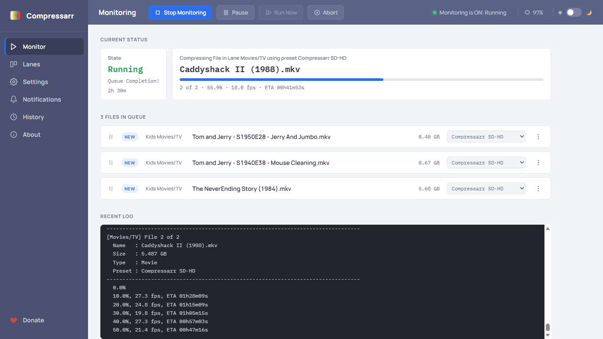
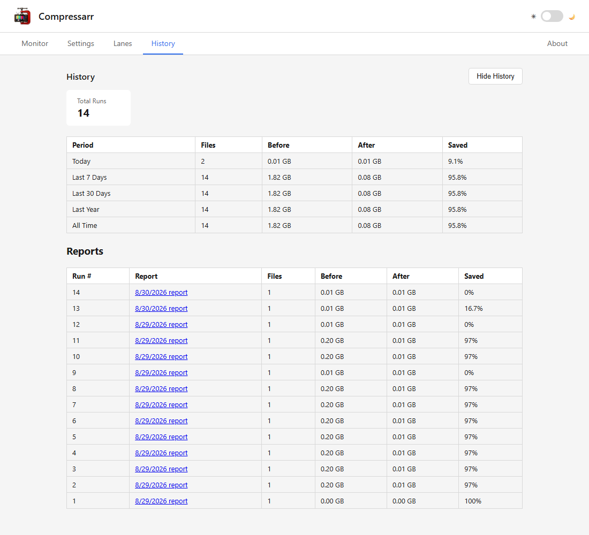
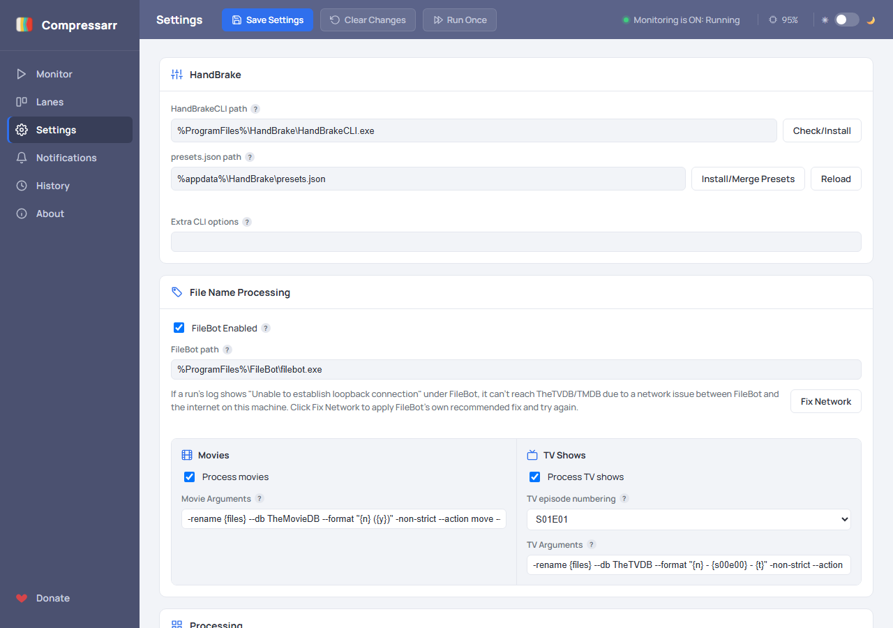
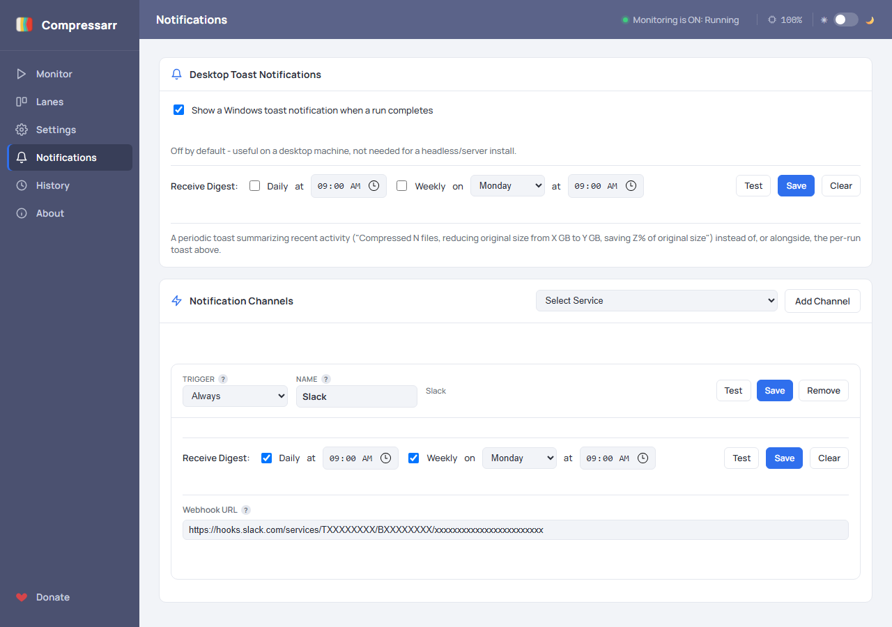
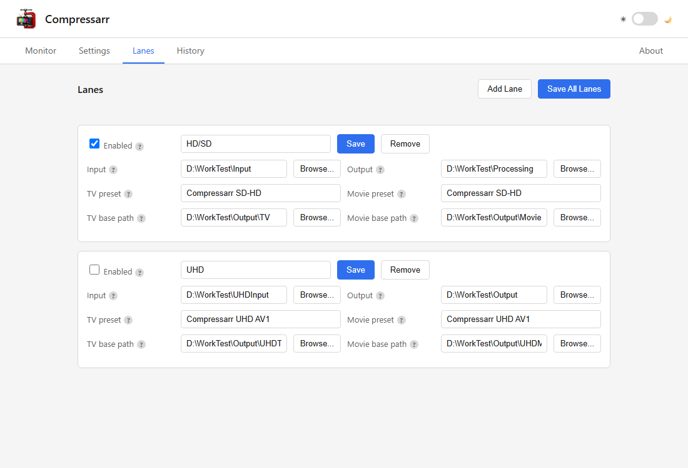

# Compressarr

**[compressarr.tv](https://compressarr.tv)** · **[Wiki (full setup guide)](https://github.com/MrWizardCT/Compressarr/wiki)**

<br clear="left">

A complete, end-to-end batch video conversion workflow - from the moment a file lands in a
watched folder to the moment you're notified it's done, with nothing manual in between.
Compressarr watches your folders, transcodes new video through
[HandBrakeCLI](https://handbrake.fr/downloads2.php), automatically files the result into an
organized TV Show/Movie library, cleans up after itself, optionally tells Sonarr/Radarr the
item no longer needs monitoring, and finishes with a standalone report plus a desktop
notification. v2 is a complete rewrite of the original PowerShell tool as a web-first app - a
system-tray-only background process with its entire UI (settings, lanes, monitoring, history,
reports) in your browser, reachable from any device on your LAN.
Both the original PowerShell version and v2 trace back to
[VidMonHB](https://github.com/mrpaulwasserman/VidMonHB), Paul Wasserman's original take on this
same idea.

Compressarr is designed to sit between apps like Radarr and Sonarr and your media server. Instead
of pointing an *arr app straight at your media library, point it at one of Compressarr's watched
folders - once it grabs a file and drops it there, Compressarr picks it up, compresses it, and
moves the finished result into your library's destination folder. That way only clean,
already-processed files ever reach your media server, keeping your library organized and at its
best quality while using a fraction of the space.

## The complete workflow

```
Watch folder → Detect TV/Movie → Convert (HandBrake) → File into library
   → Clean up source → Unmonitor in Sonarr/Radarr → Report + toast
```

1. **Watch** - each lane's Input folder is scanned for new video files, either once on demand
   (Run Once / Run Now) or continuously while monitoring is on.
2. **Detect** - every file is auto-classified as a TV episode or a Movie from its filename, no
   separate lanes needed for each.
3. **Convert** - HandBrakeCLI transcodes it using that content type's configured preset, with
   live progress (percent, fps, ETA) streamed into the Monitor page as it runs.
4. **File it** - the converted file, plus any companion files (subtitles, `.nfo`, artwork), is
   routed into an organized `Show Name\Season NN\` or `Movie Title\` folder.
5. **Clean up** - the original is deleted/recycled/kept per your setting, and now-empty source
   folders (including a TV show's own folder once its last file is converted) are removed from
   the source folder, leaving you with a clean workspace.
6. **Notify Sonarr/Radarr** *(optional)* - the matching episode/movie is marked as unmonitored so
   it isn't re-grabbed.
7. **Report** - a standalone HTML report is generated, and a Windows toast notification confirms
   the run is complete - click it to open the report, whether or not Compressarr is still
   running.

## What it does

Compressarr watches an **open-ended set of content lanes** you define yourself - add, remove,
rename, and enable/disable them from the Lanes page, each with its own Input/Output folders and
TV/Movie presets.

Within each lane, TV Shows vs Movies is **auto-detected per file**: a filename carrying a
season/episode marker (`S01E01`, `1x01`, etc.) is treated as a TV episode, everything else as a
Movie. That detected type picks which preset applies (a lane's TV preset or Movie preset) and,
if "Move converted files" is enabled, which destination it's filed into afterward - TV episodes
go to `Show Name\Season NN\` under the lane's TV base path; Movies get their own per-title
subfolder under the Movie base path.

Whatever else belongs to a converted file - subtitles, `.nfo` files, artwork sharing its name -
moves along with it immediately, even if other not-yet-processed videos still share that same
source folder. Once every video in a folder has been converted (or otherwise cleared), the
now-empty folder itself is removed too.

Processing is **sequential** - one file at a time, no parallel HandBrakeCLI jobs. If a run is
interrupted, relaunching resumes from the unprocessed files.

### Monitoring

The Monitor page is the control surface for continuous operation: **Start Monitoring** begins
watching every enabled lane on a configurable interval, with a live countdown to the next pass.
**Run Now** skips the rest of that countdown and starts immediately. **Abort** kills whatever
HandBrakeCLI process is currently running and stops monitoring outright - as opposed to **Stop
Monitoring**, which lets the file currently converting finish normally and then stops before
starting the next one (both the page and the tray icon reflect a stop the moment it's requested,
from either surface). The **In Queue** section lists every file still waiting across all enabled
lanes - lane, size, and preset - so you can see what's coming up without waiting for the current
file to finish. Drag a queued file to reorder it within its lane, or use its menu to skip it,
remove it from the queue, or override its preset for just that one file. The recent-log panel and
CPU usage update live while a pass runs.



*The media shown is representational test data only, not the actual film - your own results
(speed, file size, savings) will vary based on your source files, hardware, and preset.*

### Reports and notifications

At the end of a run, Compressarr writes a **standalone HTML report** covering per-lane results
(each file's type, preset, and Sonarr/Radarr outcome), disk savings, any errors, and rolling
Today/This Month/This Year history. The Open report after run setting
(Always/On Error/Never) controls whether it opens automatically - independent of that setting, a
Windows toast notification also confirms completion and opens the report when clicked. Each
report is labeled with a running run number (`Run #237: ...`) - a persistent, cumulative count
of runs that actually processed at least one file. The History page also lists every report
still within your configured retention window, with columns for files, before/after size, and
percent saved.


*The media shown is representational test data only, not the actual film - your own results
(speed, file size, savings) will vary based on your source files, hardware, and preset.*



---

## Installation

1. Install the [.NET 10 ASP.NET Core Runtime (x64)](https://dotnet.microsoft.com/en-us/download/dotnet/10.0/runtime)
   if you don't already have it - that single installer includes the base .NET Runtime it depends
   on too, so nothing else is needed. (You already have it if you run other ASP.NET Core-based
   apps or services.)

   > That page lists three similarly-named downloads - **.NET Desktop Runtime**, **ASP.NET Core
   > Runtime**, and **.NET Runtime**. Compressarr needs the **ASP.NET Core Runtime** specifically
   > (x64), since it hosts its own web UI. The Desktop Runtime looks like the obvious pick for a
   > desktop app, but it doesn't include what Compressarr actually needs and Compressarr will
   > refuse to start with a "You must install or update .NET" message if that's the one you grab
   > instead.
2. Download `Compressarr-Setup-x.x.x.exe` from the
   [Releases](https://github.com/MrWizardCT/Compressarr/releases) page.
3. Run it and follow the installer. It installs to Program Files, adds a Start Menu shortcut
   (and an optional desktop icon), and registers a normal Windows uninstaller.

   > **A note on Windows SmartScreen / Smart App Control**: Windows may flag the installer or
   > the app as coming from an "Unknown Publisher," or Smart App Control may block it outright
   > the first time you run it. This is expected, not a sign anything is wrong - it's the same
   > situation every independently-published Windows tool starts in, including ones you may
   > already trust and run daily (Sonarr, Radarr, and the rest of the *arr ecosystem included).
   > Windows' reputation system checks how many machines have already run the exact file you
   > downloaded, and a freshly published release starts at zero no matter how it's signed. If
   > SmartScreen shows "Windows protected your PC," click **More info**, then **Run anyway**. If
   > Smart App Control blocks it outright, either wait for the release's reputation to build (it
   > typically clears within some weeks of more people downloading it), or turn off Smart App
   > Control in Windows Security settings, same as most people running non-Store *arr-style
   > software already have. Every release is also scanned with
   > [VirusTotal](https://www.virustotal.com/) as part of publishing it - the scan link is at the
   > bottom of that release's notes on the [Releases](https://github.com/MrWizardCT/Compressarr/releases)
   > page, if you'd like to check it independently of trusting the publisher signature.
4. Launch Compressarr from the Start Menu - it runs as a tray icon only, with no window of its
   own. Right-click the tray icon for **Open Web UI**, or just browse to
   `http://localhost:1212` (or whatever port you've configured).
5. On the Settings page, use **Check/Install** next to HandBrakeCLI path to detect an existing
   install or download one automatically, and **Install/Merge Presets** to add Compressarr's own
   HandBrake presets to your `presets.json` (merging into an existing file if you already have
   one, installing fresh if you don't).

---

## Configuring Compressarr

Everything is configured from the browser - there's no desktop settings window. Every field on
these pages has a small **?** next to it with a tooltip explaining what it does.

### Settings page



| Field | What it's for |
|---|---|
| HandBrakeCLI path | Path to `HandBrakeCLI.exe` - Check/Install finds or downloads it |
| presets.json path | Path to HandBrake's presets.json - Install/Merge Presets adds Compressarr's own, Reload picks up changes made to the file without restarting Compressarr |
| Extra CLI options | Additional flags passed straight through to every HandBrakeCLI conversion |
| Video extensions | Comma-separated file extensions to scan for (default: `mkv, avi, mp4, mpg, ts, m4v`) |
| Minimum size (bytes) | Skip files smaller than this - useful for ignoring samples/junk |
| Max files per run | Caps how many files are picked up in one pass (0 = no limit) |
| Write output to same folder as input | Convert in place instead of using each lane's Output folder |
| Move converted files into show/movie folders | Turns on the TV/Movie filing step described above |
| Clear title metadata | Strips the embedded title tag (via TagLib-Sharp) so a media server reads the filename instead of stale/incorrect metadata - on by default |
| Original file after convert | Maintain, Delete, or Recycle the source file once conversion succeeds |
| On destination collision | Overwrite (default), Skip, or Rename, when a file already exists at the destination |
| Log folder / Report folder | Where run logs, the history CSV, and HTML reports are written |
| Log/report retention (days) | Logs and reports older than this are cleaned up automatically |
| Open report after run | Always, On Error, or Never |
| Enable Monitoring at Startup | Start watching lanes automatically when Compressarr launches |
| Poll interval (seconds) | How often the monitor loop checks lanes while monitoring is on |
| Start with Windows (on login) | Registers Compressarr to launch automatically at login |
| Post-execution command/arguments | Optional command to run after each pass completes |
| Sonarr/Radarr Enabled, URL, API Key | See below |
| Port | Port the web UI listens on - changing this needs a restart |

**Sonarr/Radarr integration**: after a file finishes converting successfully, Compressarr can
tell whichever app tracks it to stop monitoring that specific episode or movie, so it isn't
re-grabbed later. Matching is done entirely through the app's own `/api/v3/parse` endpoint -
Compressarr hands it the original filename, and the app's own parser reports back which
series/episode or movie it matches, if any. A miss is always treated as "leave it alone," never
as a guess.

### Backups

Settings also has a Backups card that periodically zips up your full setup - settings, lanes,
resume state, run counter, and history - to a local or network folder you choose, with
configurable interval and retention, plus a **Backup Now** button for an on-demand backup and a
list of existing backups you can restore from with one click.

#### Restoring from a backup

If your machine crashes or you're moving to a new build, Compressarr can restore your full setup
from a backup `.zip` created by the Backups feature above.

1. Install and launch Compressarr on the new machine. This creates a fresh default configuration -
   no lanes, everything empty.
2. Get the backup `.zip` onto the new machine. Restore lists the contents of a *folder*, not a
   single file elsewhere, so place it somewhere Compressarr can see it: the default
   `%CompressarrAppData%\Backups` location, any local/external drive folder, or a UNC network
   share.
3. Open the web UI and go to **Settings > Backups**.
4. In the **Folder** field, point it at wherever you put the file - type the path (a UNC path like
   `\\server\backupfolder` works too) and click elsewhere, or use **Browse...** to navigate to it.
   This works even before you've saved any settings on the new machine.
5. The **Existing backups** table below refreshes automatically and should list your backup file
   (name, size, date).
6. Click **Restore** on that row and confirm the warning dialog.

Your settings, lanes, resume state, run counter, and history are restored from the backup.

Two things to know:
- **HandBrake presets are not included** in the backup (it's HandBrake's own file, stored outside
  Compressarr's data folder). If HandBrake is also freshly installed, use the **Install/Merge
  Presets** button on Settings (in the HandBrake card) to re-add Compressarr's presets to it.
- Use **Backup Now** on Settings at any time to take a fresh backup before decommissioning a
  machine, rather than relying only on the automatic schedule.

### Notifications page



Get a message wherever you already look - Discord, Slack, your phone, a self-hosted push server,
or any automation platform - when a run finishes. Every channel is optional and off by default;
add as many as you want, of as many different types as you want (two Discord servers, a Slack
workspace, and a phone push, all at once).

**Desktop toast notifications**: a Windows toast confirming completion and opening the report when
clicked. Off by default (useful on a desktop machine, not needed for a headless/server install) -
toggle it on the Notifications page.

**Notification channels**: click **Add Channel**, pick a service from the dropdown, and fill in
its fields - every field has a **?** bubble next to it explaining what it needs and, where
relevant, where to find it. Each channel has:

| Field | What it's for |
|---|---|
| Trigger | Always, On error or warning, or Never (kept configured but disabled without deleting it) |
| Name | A friendly label to tell channels of the same type apart, e.g. two different Discord servers |
| Test | Sends a test message using whatever's currently typed in, even if not yet saved |
| Save / Remove | Persist or delete this channel |

**What data is sent**: every channel receives the run number, an aggregate summary (e.g. "12
file(s) processed, 4.2 GB saved"), and the outcome (success/warning/error) - never filenames,
media titles, folder paths, or anything else from your configuration. The one exception is the
local path to the HTML report file, which only the **Generic Webhook** and **IFTTT** channels
include - worth knowing before pointing either at a third-party service, since a path like
`C:\Users\you\AppData\Roaming\Compressarr\Reports\...` leaves your machine as plain text. Every
other channel type (Discord, Slack, Telegram, Pushover, ntfy, Gotify, Notifiarr) never sends the
report path at all.

#### Supported services

| Service | What it needs |
|---|---|
| [Generic Webhook](#generic-webhook-zapier-make-n8n-node-red-home-assistant) | A URL, HTTP method, and optional custom headers |
| [Discord](#discord) | A channel webhook URL |
| [Slack](#slack) | An incoming webhook URL |
| [Telegram](#telegram) | A bot token and chat ID |
| [Pushover](#pushover) | An application token and user key |
| [ntfy](#ntfy) | A server URL (defaults to the public ntfy.sh) and topic |
| [Gotify](#gotify) | Your self-hosted server URL and an application token |
| [Notifiarr](#notifiarr) | Your Notifiarr API key and a Discord channel ID |
| [IFTTT](#ifttt) | An event name and your Webhooks key |

##### Generic Webhook (Zapier, Make, n8n, Node-RED, Home Assistant)

Posts a JSON body (title, outcome, file count, space saved, duration, report path) to any URL you
give it, with an HTTP method and custom headers of your choosing. This single channel type also
fully covers **Zapier** ("Webhooks by Zapier"), **Make** ("Webhooks" module), **n8n** (Webhook
node), **Node-RED** (`http in` node), and **Home Assistant** (a webhook automation trigger) - all
of them accept an arbitrary POST with no required shape, so just point this at whichever
platform's own webhook URL.

##### Discord

In Discord, go to a channel's **Edit Channel > Integrations > Webhooks**, create one, and paste
its URL into the Webhook URL field. Compressarr posts a color-coded embed (green/yellow/red for
success/warning/error) with file count, space saved, and duration.

##### Slack

Create an **Incoming Webhook** for your workspace at [api.slack.com/apps](https://api.slack.com/apps)
and paste its URL in. Messages use Slack's mrkdwn formatting with a status emoji.

##### Telegram

Message **@BotFather** on Telegram to create a bot and get its Bot Token. For the Chat ID, message
**@userinfobot** to find your own, or check your bot's `getUpdates` response for a group/channel
ID. Messages are sent as plain text.

##### Pushover

Create an Application at [pushover.net/apps/build](https://pushover.net/apps/build) for the
Application API Token, and find your User Key on your Pushover dashboard.

##### ntfy

Works with the public [ntfy.sh](https://ntfy.sh) instance out of the box - just pick a Topic (any
string; make it unique and hard to guess, since anyone who knows it can subscribe to it too). If
you self-host ntfy, change the Server URL to point at your own instance. An optional Access Token
supports protected topics.

##### Gotify

Gotify is self-hosted only (no public hosted service) - point Server URL at your own instance, and
create an Application in Gotify's web UI (Apps tab) for the Application Token.

##### Notifiarr

Built for the *arr ecosystem: relays into whichever Discord channel your Notifiarr integration is
configured to post to. Find your API Key on your Notifiarr account page under **My Account > API
Key**. For the Discord Channel ID, enable Developer Mode in Discord (User Settings > Advanced),
then right-click the target channel and **Copy Channel ID**.

##### IFTTT

Create an applet with a **Receive a web request** trigger and give it an Event Name (used in the
Event Name field here). Find your Webhooks Key at
[ifttt.com/maker_webhooks](https://ifttt.com/maker_webhooks) under Documentation - it's the string
after `/use/` in your personal URL. Compressarr sends title/body/report path as IFTTT's
`value1`/`value2`/`value3` ingredients for use in your applet's action.

### Lanes page



Add, remove, rename, and enable/disable lanes freely - there's no fixed limit. Each lane has:

| Field | What it's for |
|---|---|
| Enabled | Turns this lane's processing on/off without clearing its configured paths |
| Input | Where Compressarr looks for source video files for this lane |
| Output | Where HandBrake writes the converted file initially |
| TV preset / Movie preset | HandBrake preset used for each detected content type - autocompletes from your presets.json |
| TV base path / Movie base path | Final destination once a file's type has been detected, if Move converted files is on |

Every path field has a **Browse...** button that opens a server-side folder picker, since a
browser's native file picker can't see the server's filesystem. **Save All Lanes** saves every
lane on the page in one click.

### How files move through a lane

**Output** is a transient staging spot, not a final destination - it's just where HandBrake
writes the converted file the moment encoding finishes. If **Move converted files into
show/movie folders** is on, the file (and any companion subtitles/`.nfo`/artwork) is picked up
from there and relocated into the lane's TV/Movie base path; if that setting is off, everything
just stays wherever Output put it.

```
D:\Media\Input\                              (before a run)
├── Breaking Bad S01E01.mkv
├── Breaking Bad S01E01.eng.srt
├── Breaking Bad S01E02.mkv
├── Breaking Bad S01E02.eng.srt
├── Caddyshack (1980).mkv
└── Caddyshack (1980).nfo

        │  HandBrake converts each file with the lane's TV/Movie
        │  preset, writing the result to Output - then, since Move
        │  converted files is on, each one is relocated below.
        ▼

D:\Media\TV\                                 (this lane's TV base path)
└── Breaking Bad\
    └── Season 01\
        ├── Breaking Bad S01E01.mkv
        ├── Breaking Bad S01E01.eng.srt
        ├── Breaking Bad S01E02.mkv
        └── Breaking Bad S01E02.eng.srt

D:\Media\Movies\                             (this lane's Movie base path)
└── Caddyshack (1980)\
    ├── Caddyshack (1980).mkv
    └── Caddyshack (1980).nfo

D:\Media\Input\                              (after - now empty, ready
                                               for the next batch)
```

Originals are deleted, recycled, or kept per **Original file after convert**; if a source
subfolder ends up with nothing left to convert, it's removed too - including a TV show's own
folder once its last episode has been converted.

### Custom presets

Compressarr ships with two of its own HandBrake presets, installed via **Install/Merge Presets**
on the Settings page - they're what the sample lanes above use for TV preset / Movie preset.

**Compressarr SD-HD** - for standard and HD sources. Encodes to H.265 (x265, 10-bit, Main10
profile) at a constant quality slider of 24, using the "veryfast" encoder preset with two-pass
encoding (turbo first pass). Audio is mixed down to E-AC3 (Dolby Digital Plus) at 512 kbps,
supporting up to 7.1 channels. Also auto-crops black bars, keeps English subtitles, and
preserves chapter markers.

**Compressarr UHD AV1** - for 4K/UHD sources. Encodes to AV1 (SVT-AV1, 10-bit, Main profile) at
a constant quality slider of 30, encoder preset 4 (tuned for PSNR), with two-pass encoding
(turbo first pass). Audio tracks are copied through as-is where possible, falling back to E-AC3
at 640 kbps otherwise. Same auto-crop, English subtitles, and chapter markers as above.

In testing, both presets have achieved size reductions of **80% or more**, depending heavily on
the source file's original bitrate, resolution, and codec - an already efficiently-encoded
source will see smaller savings than a large, lightly-compressed one.

### Saving and running

- **Save Settings** / **Save** (per lane) write changes back to the config without running
  anything.
- **Run Once** (Settings page) runs a single pass immediately with whatever's currently saved.
- **Start Monitoring** / **Stop Monitoring** / **Run Now** / **Abort** (Monitor page) control
  continuous operation - see [Monitoring](#monitoring) above.

---

## Running it

Compressarr has no command-line interface - it's a tray-only background app. Right-click the
tray icon for:

- **Open Web UI** - opens the browser to Compressarr's own address
- **Start Monitoring** / **Stop Monitoring** - mirrors the Monitor page's buttons; either surface
  reflects the other's state
- **Exit** - shuts down the web server and closes Compressarr

If **Enable Monitoring at Startup** is on (Settings page), monitoring begins automatically as
soon as Compressarr launches - useful together with **Start with Windows** for a fully
hands-off setup.

## Configuration file reference

Config is JSON, stored per-user at `%AppData%\Compressarr\compressarr.settings.json` rather than
next to the install folder, so upgrades never overwrite your settings. Paths may contain
`%ENVVAR%` tokens (e.g. `%ProgramFiles%`, plus Compressarr's own `%CompressarrAppData%`),
expanded at the point of use. This shows the shipped defaults - lanes start empty; add your own
from the Lanes page.

```json
{
  "HandBrake": {
    "CliPath": "%ProgramFiles%\\HandBrake\\HandBrakeCLI.exe",
    "PresetsPath": "%appdata%\\HandBrake\\presets.json",
    "Options": ""
  },
  "Lanes": [],
  "Processing": {
    "VidTypes": ["mkv", "avi", "mp4", "mpg", "ts", "m4v"],
    "OutSameAsIn": false,
    "DeleteAfterConvert": "Recycle",
    "MoveFiles": true,
    "ClearTitleMetadata": true,
    "Limit": 0,
    "MinSizeBytes": 0
  },
  "Logging": { "LogFilePath": "%CompressarrAppData%\\Logs", "RetentionDays": 30 },
  "PostExec": { "Cmd": "", "Args": "" },
  "Report": { "ReportPath": "%CompressarrAppData%\\Reports", "OpenAfterRun": "OnError" },
  "Repeat": { "Count": 0, "Monitor": false, "PollIntervalSeconds": 60 },
  "Startup": { "CountdownSeconds": 10, "RunAtLogin": false },
  "Arrs": {
    "Sonarr": { "Enabled": false, "Url": "", "ApiKey": "" },
    "Radarr": { "Enabled": false, "Url": "", "ApiKey": "" }
  },
  "Web": { "Port": 1212 }
}
```

The output file extension is derived from whichever preset was selected, rather than being
hardcoded.

## Project layout

```
src/
  Compressarr.Core/       Conversion engine, config, reporting, HandBrake/Sonarr/Radarr clients -
                           platform-agnostic, no UI dependencies
  Compressarr.Web/         Minimal-API endpoints + wwwroot (the entire browser UI: vanilla JS/HTML/CSS)
  Compressarr.Desktop/     Tray-only host - Avalonia TrayIcon, Windows toast notifications, composition root
installer/
  Compressarr.iss           Inno Setup script that packages the framework-dependent publish output
tests/
  Compressarr.Core.Tests/   xUnit tests for Core
CHANGELOG.md               Release history
```

## TagLib-Sharp (metadata handling)

Compressarr uses [TagLib-Sharp](https://github.com/mono/taglib-sharp) to strip the embedded title
tag from converted files, so a media server reads the filename instead of a stale/incorrect title
baked into the file's metadata. This is controlled by the **Clear title metadata** setting on the
Settings page (on by default).

- **What it is**: an open-source, cross-platform .NET library for reading and writing media file
  tags.

## Disclaimer

Compressarr is intended for personal use only, with media files you legally own or otherwise have
the right to compress and manage. You are solely responsible for ensuring your use complies with
applicable copyright law and any licensing terms attached to your media. This tool is provided
as-is, with no warranty of any kind - use it at your own risk.

## License

Compressarr is licensed under the [GNU General Public License v3.0](LICENSE).

Copyright (C) 2026 Mark Wasserman
