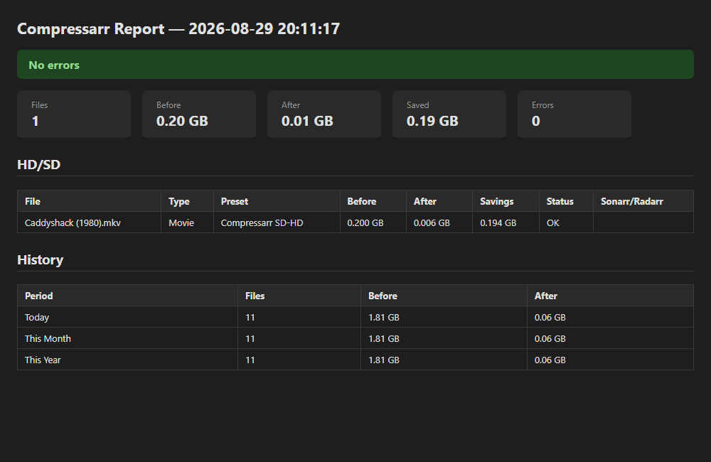
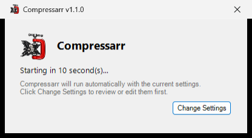
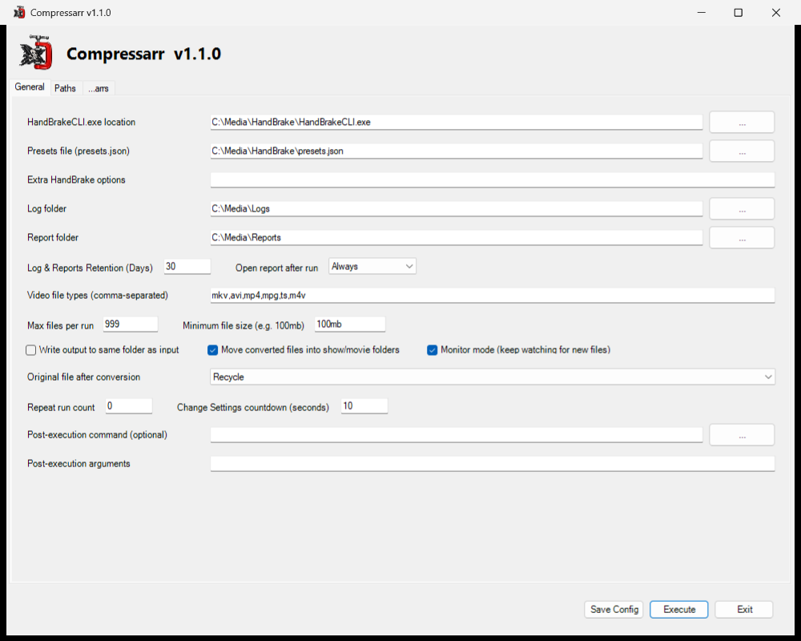
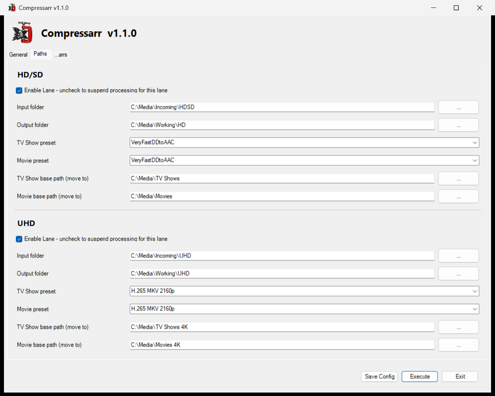
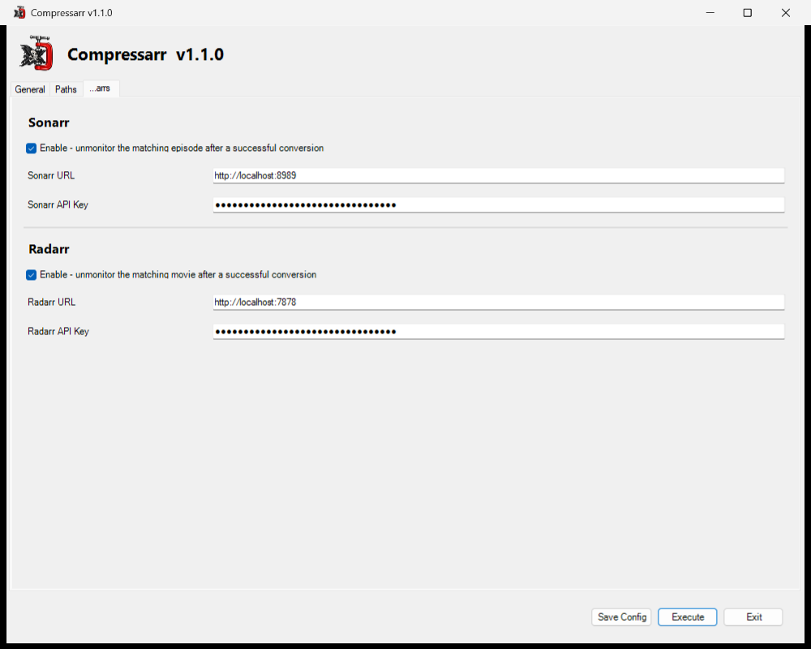

# Compressarr

<br clear="left">

A complete, end-to-end Windows batch video conversion workflow - from the
moment a file lands in a watched folder to the moment you're notified it's
done, with nothing manual in between. Compressarr watches your folders,
transcodes new video through
[HandBrakeCLI](https://handbrake.fr/downloads2.php), automatically files
the result into an organized TV Show/Movie library, cleans up after
itself, optionally tells Sonarr/Radarr the item no longer needs
monitoring, and finishes with a standalone report plus a desktop
notification. A from-scratch rewrite of
[VidMonHB](https://github.com/mrpaulwasserman/VidMonHB), keeping the same
core idea while adding an independent UHD content lane, Sonarr/Radarr
integration, and a modular codebase.

## The complete workflow

```
Watch folder → Detect TV/Movie → Convert (HandBrake) → File into library
   → Clean up source → Unmonitor in Sonarr/Radarr → Report + toast
```

1. **Watch** - each lane's Input folder is scanned for new video files, either once per launch or continuously in Monitor mode.
2. **Detect** - every file is auto-classified as a TV episode or a Movie from its filename, no separate lanes needed for each.
3. **Convert** - HandBrakeCLI transcodes it using that content type's configured preset.
4. **File it** - the converted file, plus any companion files (subtitles, `.nfo`, artwork), is routed into an organized `Show Name\Season NN\` or `Movie Title\` folder.
5. **Clean up** - the original is deleted/recycled/kept per your setting, and now-empty source folders (including a TV show's own folder once its last season is gone) are removed.
6. **Notify Sonarr/Radarr** *(optional)* - the matching episode/movie is unmonitored so it isn't re-grabbed.
7. **Report** - a standalone HTML report is generated, and a desktop toast notification confirms the run is complete - click it to open the report, whether or not Compressarr is still running.

## What it does

Compressarr watches **two independent content lanes**, each with its own
input folder:

| Lane | Purpose |
|---|---|
| HD/SD | Standard/HD video sources |
| UHD | 4K/UHD video sources |

Within each lane, TV Shows vs Movies is **auto-detected per file**, the same
way Paul's VidMonHB does it: a filename carrying a season/episode marker
(`S01E01`, `1x01`, etc.) is treated as a TV episode, everything else as a
Movie. That detected type picks which preset applies (a lane's `tvPreset` or
`moviePreset`) and, if "move files" is enabled, which destination it's filed
into afterward - TV episodes go to `Show Name\Season NN\` under the lane's
`tvShowBasePath`; Movies get bucketed into year-range folders (e.g.
`03. Movies 2000-2019`) under `movieBasePath`, then into their own
per-title subfolder within that (e.g. `Caddyshack (1980)\`) - anything
after the year tag in the filename is dropped for the folder name itself
(`Caddyshack (1980) {edition-Director's Cut}.mkv` still becomes
`Caddyshack (1980)\`), though the file keeps its full original name.

If a converted file's source folder holds nothing else that still needs
converting, whatever else is sitting in there - subtitles, `.nfo` files,
artwork - comes along too: moved in alongside it when
`deleteAfterConvert` is `Delete`/`Recycle` (with the source folder then
cleared out and removed entirely), or copied there when it's `Maintain`
(leaving the source folder untouched). If other not-yet-processed video
files still share that folder, none of this happens - only the file that
was actually converted is touched, so nothing waiting its turn gets
disturbed.

Processing is **sequential** - one file at a time, no parallel HandBrakeCLI
jobs. If a run is interrupted, relaunching resumes from the unprocessed
files (tracked in `compressarr.resume.json`). Progress is logged as a neat
multi-line block per file (name, original size, detected type, and preset
in use), not a single cramped banner line.

At the end of a run, Compressarr writes a **standalone HTML report** to the
`Reports\` folder (no email/SMTP involved) covering per-lane results (with
each file's type, preset, and Sonarr/Radarr outcome), disk savings, any
errors, and daily/monthly/yearly history rollups. The `report.openAfterRun`
setting (`Always`/`Error`/`Never`) controls whether it opens automatically
- independent of that setting, a desktop toast notification also confirms
completion and opens the report when clicked (see **Completion toast**
under the General tab, below). Each report is labeled with a running run
number (`Run #237: ...`) - a persistent, cumulative count of runs that
actually processed at least one file (tracked in
`compressarr.runcount.json`; empty scans, including quiet monitor-mode
polls, don't count).



### Startup screen

The very first time Compressarr is ever run, it opens straight to the full
configuration screen. Every launch after that shows a brief splash instead
- the logo, a countdown, and a **Change Settings** button. Click it to open
the config screen; if nothing is clicked before the countdown reaches zero,
Compressarr runs automatically with whatever's already configured. The
countdown length (default 10s) is itself a General tab setting.



If a previous run left files tracked in `compressarr.resume.json` (killed
mid-run, or a file that errored out), a similar prompt appears right
after this one - a red warning showing how many files are still tracked,
with **Clear Resume Cache** (discard them, start fresh) or **Finish
Processing Files** (pick up where it left off) - again defaulting to
Finish if left untouched.

---

## Installation

### 1. Download and extract

Grab the latest release zip from the
[Releases page](https://github.com/MrWizardCT/Compressarr/releases) and
extract it anywhere (e.g. `C:\tools\Compressarr`).

### 2. Unblock the files

**This step is required.** Windows tags any file that came from the internet
- your browser does this to the zip the moment it finishes downloading, and
File Explorer carries that tag onto every file when you extract it. With
that tag still in place, PowerShell will refuse to run the scripts (you'll
typically see an error mentioning the file "is not digitally signed" or
"cannot be loaded"), regardless of your execution policy setting.

This is Windows marking a *specific downloaded file* as untrusted, not
something that can be pre-cleared inside the zip itself before you download
it - it only happens client-side, after the file reaches your machine.
Clearing it takes one command, run **after** extracting:

```powershell
Get-ChildItem -Path "C:\tools\Compressarr" -Recurse | Unblock-File
```

(Swap in wherever you actually extracted it.) You only need to do this
once per download. If you'd rather do it by hand for a single file: right
click the file → **Properties** → check **Unblock** at the bottom of the
General tab → **OK**.

### 3. Allow PowerShell scripts to run

Separately from the block above, PowerShell's execution policy controls
whether *any* unsigned script can run at all. If you've never changed this
before:

```powershell
Set-ExecutionPolicy Unrestricted -Scope CurrentUser -Force
```

### 4. Install HandBrakeCLI

Download and install the command-line version of HandBrake:
[handbrake.fr/downloads2.php](https://handbrake.fr/downloads2.php). Default
install location is `%ProgramFiles%\HandBrake\HandBrakeCLI.exe`, which is
already what Compressarr's default config expects.

### 5. Get a HandBrake presets file

Compressarr needs a `presets.json` to read preset definitions from (encoder
settings, container format, etc.). The default location Compressarr looks
for is `%appdata%\HandBrake\presets.json`.

The shipped default config's HD/SD lane preset is `VeryFastDDtoAAC`, one of
HandBrake's own built-in presets - install the full
[HandBrake GUI](https://handbrake.fr/downloads.php) once and it creates a
`presets.json` with all the built-in presets already in it, so the config
works as shipped with no further setup there. The UHD lane's preset is
left blank, since a good UHD preset depends on your own hardware (HEVC/AV1
encoder support, etc.) - pick one from your `presets.json` via the GUI's
Paths tab once you've decided.

Using your own custom presets instead is just as easy - export them from
the HandBrake GUI, or start from
[MrWizardCT/Handbrake-Custom-Presets](https://github.com/MrWizardCT/Handbrake-Custom-Presets).
Point `handbrake.presetsPath` in the config (or the "Presets file" field in
the GUI's General tab) at whichever `presets.json` you're using, and set
each lane's TV/Movie preset fields to match.

### 6. (Optional) Title metadata clearing

Drop `taglib-sharp.dll` next to `Compressarr.ps1` if you want the Title tag
cleared from converted files. Not required - skipped silently if absent.

---

## Configuring Compressarr

Launch it once to open the setup GUI:

```powershell
.\Compressarr.ps1
```

If no config file exists yet at the default location
(`Config\compressarr.settings.json`), Compressarr writes one out with
defaults so there's something to edit and save.

### General tab



Settings that apply across both lanes:

| Field | What it's for |
|---|---|
| HandBrakeCLI.exe location | Path to `HandBrakeCLI.exe` (step 4 above) |
| Presets file | Path to `presets.json` (step 5 above) |
| Extra HandBrake options | Any additional flags passed straight through to HandBrakeCLI |
| Log folder | Where per-run summary and detail logs are written |
| Log & Reports Retention (Days) | Logs and HTML reports older than this are cleaned up automatically |
| Report folder | Where the HTML report for each run is written |
| Open report after run | `Always`, `Error` (only if something failed), or `Never` |
| Video file types | Comma-separated extensions to scan for (default: `mkv,avi,mp4,mpg,ts,m4v`) |
| Max files per run | Caps how many files are picked up in one pass |
| Minimum file size | Skip anything smaller than this (e.g. `100mb`) - useful for ignoring samples/junk |
| Write output to same folder as input | Skip the lane's Output folder and convert in place |
| Move converted files into show/movie folders | Turns on the TV/Movie filing step described above |
| Original file after conversion | `Maintain`, `Delete`, or `Recycle` the source file once conversion succeeds |
| Post-execution command/arguments | Optional command to run after each full run completes |
| Repeat run count | Run the whole pass this many additional times back-to-back |
| Change Settings countdown (seconds) | How long the startup splash waits before running automatically (see Startup screen above) |
| Monitor mode | Keep watching the lane input folders and auto-run when new files show up |

**Completion toast**: independent of "Open report after run" (which can be
set to `Error` or `Never`), every run that actually processed at least one
file also shows a Windows toast notification in the lower-right corner -
logo, file count, before/after size and savings, and duration. Clicking it
opens the full report in your default browser, whether or not Compressarr
is still running (useful for an unattended/scheduled run you check on
later). The toast is sent under PowerShell's own notification identity
rather than a Compressarr-specific one, so Action Center's sender/grouping
UI shows "Windows PowerShell" even though the toast itself displays
Compressarr's logo and content.

### Paths tab



Both lane sections on this tab have the same seven fields - fill in
whichever lane(s) you actually plan to use; an empty **Input folder**
means that lane is skipped entirely, same as unchecking **Enable Lane**.

| Field | What it's for |
|---|---|
| Enable Lane | Turns this lane's processing on/off - uncheck to suspend a lane without clearing its configured paths/presets |
| Input folder | Where Compressarr looks for source video files for this lane (This should be the folder where Sonarr/Radarr drops its files) |
| Output folder | Where HandBrake writes the converted file initially |
| TV Show preset | HandBrake preset used for files detected as TV episodes |
| Movie preset | HandBrake preset used for everything else |
| TV Show base path (move to) | Final destination for TV episodes, if "move files" is on - Compressarr creates `Show Name\Season NN\` under here |
| Movie base path (move to) | Final destination for movies, if "move files" is on - bucketed into year-range subfolders |

**Output folder vs. base path** - these do two different jobs in the
pipeline:

```
Input folder → HandBrake converts → Output folder → (if "Move files" is on) → base path's organized folders
```

- **Output folder** is where HandBrake writes the converted file
  immediately after encoding - just a working/staging location. If
  "write output to same folder as input" is checked, this is skipped
  entirely and the converted file lands next to the source instead.
- **TV Show / Movie base path** only comes into play if "Move converted
  files into show/movie folders" is checked. Once conversion succeeds,
  the file is picked up from wherever it just landed (the Output folder,
  or the source folder) and relocated into `Show Name\Season NN\` or a
  year-range/movie-title folder under the base path.

If "Move files" is off, the base paths are never used - everything just
stays wherever the Output folder put it. To end up with everything
organized by show/movie in one step, point Output at a scratch/working
folder and the base paths at your real library location, then turn
"Move files" on.

Preset fields are dropdowns populated from your `presets.json`; a field
turns red/highlighted if it doesn't match anything in that file, or a path
doesn't exist yet.

### ...arrs tab



Optional integration with [Sonarr](https://sonarr.tv/) and
[Radarr](https://radarr.video/): after a file finishes converting
successfully, Compressarr can tell whichever app tracks it to stop
monitoring that specific episode or movie, so it doesn't get re-grabbed
later. Sonarr and Radarr are each configured independently - enable
either, both, or neither.

| Field | What it's for |
|---|---|
| Enable | Turns this service's unmonitor step on/off - everything else on this tab is ignored while unchecked |
| URL | The app's base URL, e.g. `http://localhost:8989` (Sonarr) or `http://localhost:7878` (Radarr) |
| API Key | Found in the app's own **Settings → General** page |

Matching is done entirely through the app's own `/api/v3/parse` endpoint -
Compressarr hands it the original filename, and the app's own parser
(the same one it uses for manual imports) reports back which series/episode
or movie it matches, if any. Compressarr doesn't attempt any matching of
its own: if the app can't match the filename to something already in its
library, nothing is changed - a miss is always treated as "leave it alone,"
never as a guess. This step runs after every successful conversion,
independent of whether "Move converted files into show/movie folders" is
on - it's about the conversion having finished, not about local file
organization.

If a service is enabled but its URL or API key is left blank, the field is
highlighted the same way an invalid path or preset would be.

### Saving and running

- **Save Config** writes your changes back to the config file without
  running anything - handy for setting things up before a real pass.
- **Execute** runs a conversion pass immediately with whatever's currently
  in the form (saving first is optional - Execute uses the form's current
  values either way).
- **Exit** closes without running.

---

## Running it

```powershell
# Interactive - opens the configuration GUI, then runs on Execute
.\Compressarr.ps1

# Headless - runs immediately using the config file on disk
.\Compressarr.ps1 -NoGui

# Use a specific config file
.\Compressarr.ps1 -ConfigPath "D:\MyConfigs\uhd-only.json"

# Force exactly one run, ignoring repeat count / monitor mode
.\Compressarr.ps1 -Once
```

## Configuration file reference

Config is JSON (`Config\compressarr.settings.json` by default). Paths may
contain `%ENVVAR%` tokens (e.g. `%ProgramFiles%`), expanded at the point of
use so the same file works across machines. The JSON below shows the
shipped defaults - each lane's paths are left blank and the UHD preset is
unset, since those are specific to your own folder layout and
`presets.json`; fill them in via the GUI's Paths tab, or by hand here. The
HD/SD preset defaults to HandBrake's built-in `VeryFastDDtoAAC` as a
reasonable starting point. See
[Handbrake-Custom-Presets](https://github.com/MrWizardCT/Handbrake-Custom-Presets)
for the author's own preset set if you'd rather start from those.

```json
{
  "handbrake": {
    "cliPath": "%ProgramFiles%\\HandBrake\\HandBrakeCLI.exe",
    "presetsPath": "%appdata%\\HandBrake\\presets.json",
    "options": ""
  },
  "contentLanes": {
    "hdsd": {
      "enabled": true,
      "input": "",
      "output": "",
      "tvPreset": "VeryFastDDtoAAC",
      "moviePreset": "VeryFastDDtoAAC",
      "tvShowBasePath": "",
      "movieBasePath": ""
    },
    "uhd": {
      "enabled": true,
      "input": "",
      "output": "",
      "tvPreset": "",
      "moviePreset": "",
      "tvShowBasePath": "",
      "movieBasePath": ""
    }
  },
  "processing": {
    "vidTypes": ["mkv", "avi", "mp4", "mpg", "ts", "m4v"],
    "outSameAsIn": false,
    "deleteAfterConvert": "Maintain",
    "moveFiles": false,
    "limit": 999,
    "minSize": "0gb"
  },
  "logging": { "logFilePath": ".\\Logs", "retentionDays": 30 },
  "postExec": { "cmd": "", "args": "" },
  "report": { "reportPath": ".\\Reports", "openAfterRun": "Always" },
  "repeat": { "count": 0, "monitor": true },
  "startup": { "countdownSeconds": 10 },
  "arrs": {
    "sonarr": { "enabled": false, "url": "http://localhost:8989", "apiKey": "" },
    "radarr": { "enabled": false, "url": "http://localhost:7878", "apiKey": "" }
  }
}
```

Each lane's `output` is where HandBrake initially writes the converted
file; `tvShowBasePath`/`movieBasePath` are only used if `moveFiles` is on,
as the final destination once a file's type has been detected.

The output file extension is derived from whichever preset was selected
(its `FileFormat` value in `presets.json`, mapping `av_mp4`/`mp4` to `.mp4`
and `av_mkv`/`mkv` to `.mkv`) rather than being hardcoded.

`arrs.sonarr`/`arrs.radarr` are both off by default; see the
[...arrs tab](#arrs-tab) section above for what they do and how matching
works.

## Project layout

```
Compressarr.ps1                  Entry point
Modules/
  Compressarr.Config.psm1        JSON config load/save, env-var expansion, presets.json helpers
  Compressarr.Conversion.psm1    HandBrakeCLI invocation, resume state, extension derivation
  Compressarr.FileRouting.psm1   TV/Movie auto-detection + move-to-folder logic
  Compressarr.Logging.psm1       Log file writer, cleanup, history CSV
  Compressarr.Reporting.psm1     Standalone HTML report generator
  Compressarr.UI.psm1            WinForms GUI
Assets/                          Logo + icon used by the GUI and the HTML report
Config/compressarr.settings.json Sample/default config
Logs/                            Per-run log files (gitignored)
Reports/                         Per-run HTML reports (gitignored)
```

## Differences from VidMonHB

- Two independent HD/SD and UHD lanes (Paul's version has one shared input
  folder); TV-vs-Movie detection within each lane uses Paul's original
  filename-based logic.
- JSON config instead of `.ps-properties`.
- Modular `.psm1` files instead of one 3,000-line script.
- No email/SMTP notifications - a standalone HTML report instead.
- No parallel processing - strictly sequential, one file at a time.
- Output extension is derived from the preset's `FileFormat`, not hardcoded to `.mp4`.
- Fixed a season/episode parsing bug: filenames with 3+ digit season or
  episode numbers (`S123E45`, `S01E123`) now parse correctly instead of
  being truncated to 1-2 digits.
- Per-file progress is a neat multi-line block (name, size, type, preset)
  instead of a single cramped banner line.
- Movies get their own per-title subfolder when moved (like TV already
  gets `Show Name\Season NN\`), not left loose in the year-range bucket.
- Companion files (subtitles, `.nfo`, artwork) sitting alongside a
  converted file move or copy along with it, and the source folder gets
  cleaned up and removed once empty (Delete/Recycle mode) - guarded
  against shared folders that still hold other unconverted videos.
- Persistent run counter and a startup countdown screen (see below)
  instead of always forcing the config screen open.
