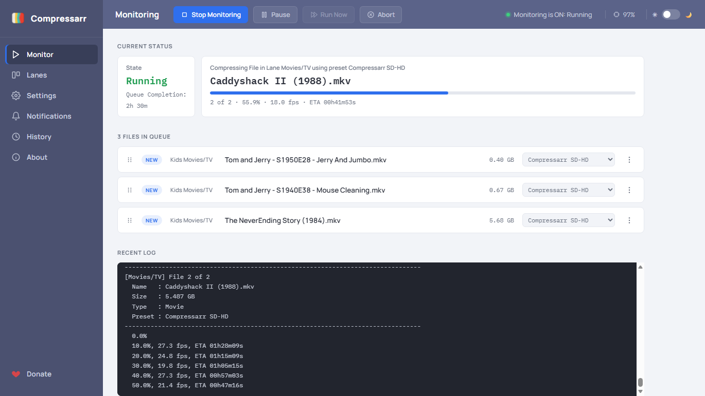
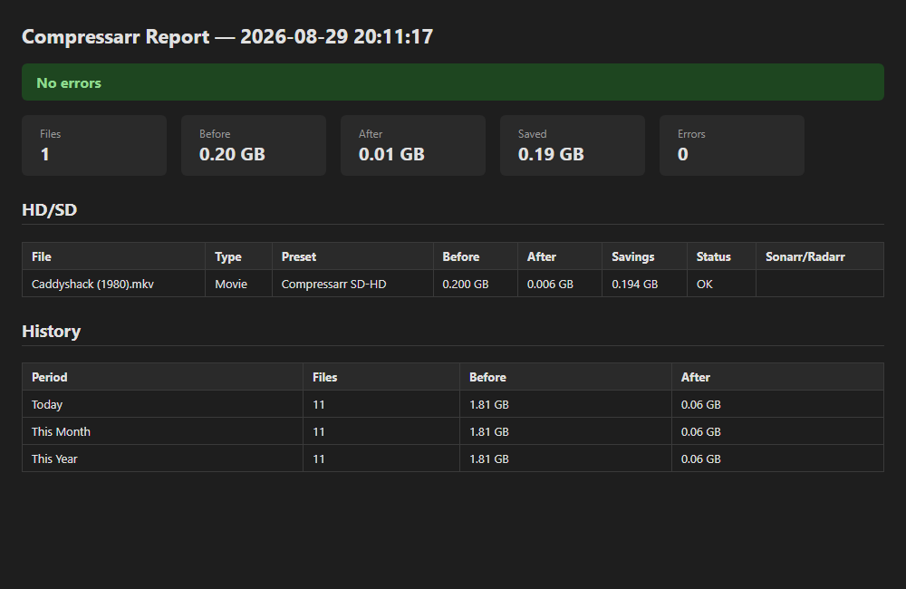
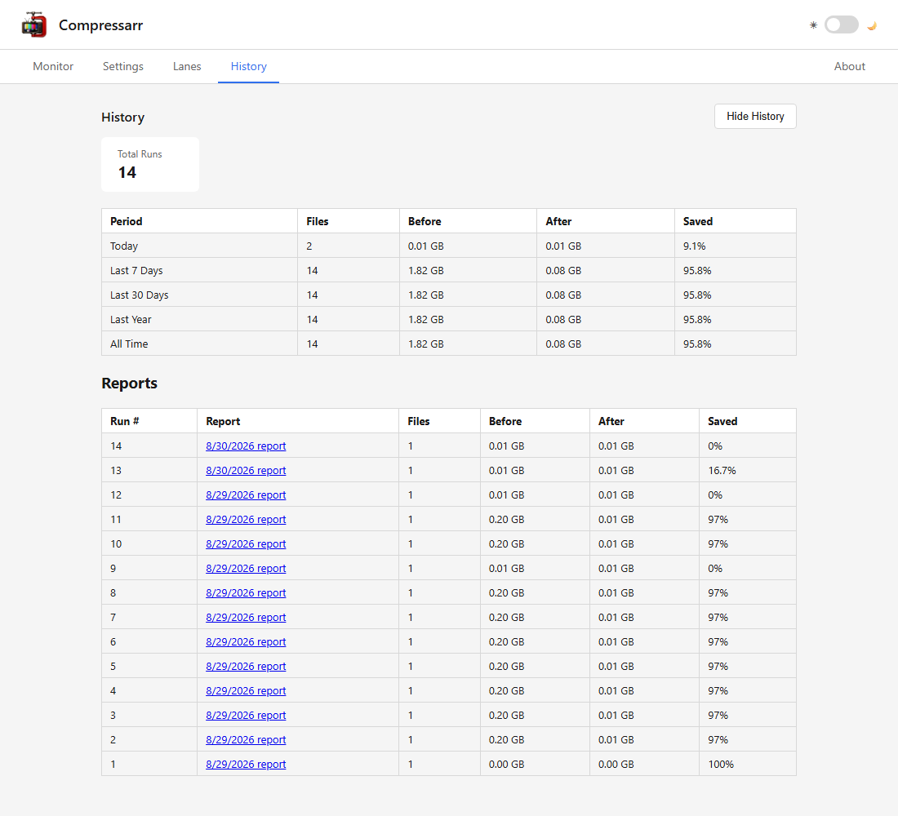
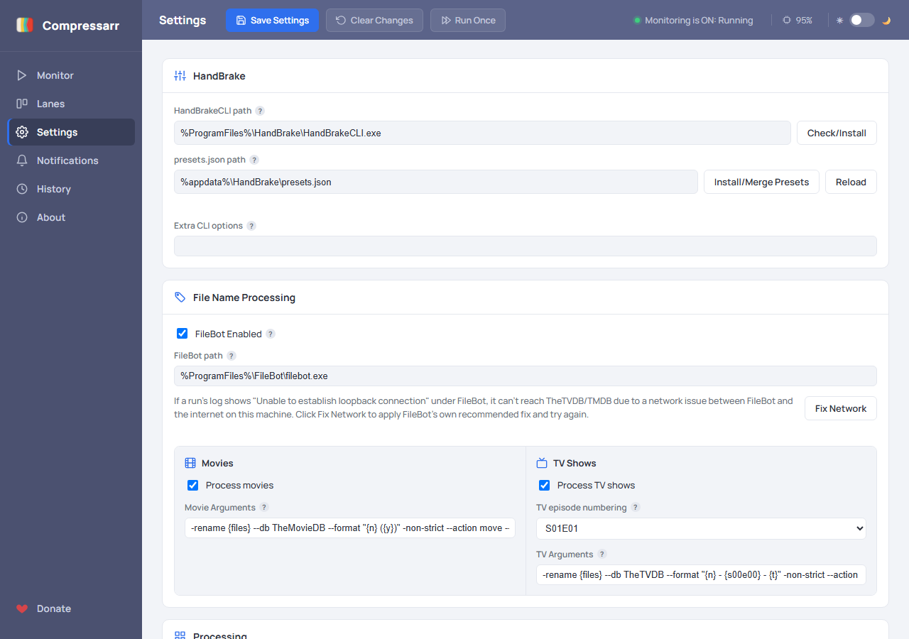
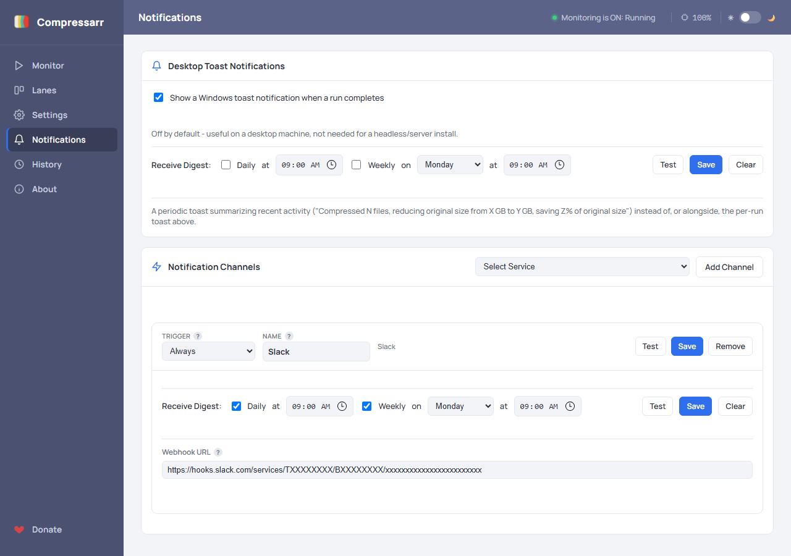
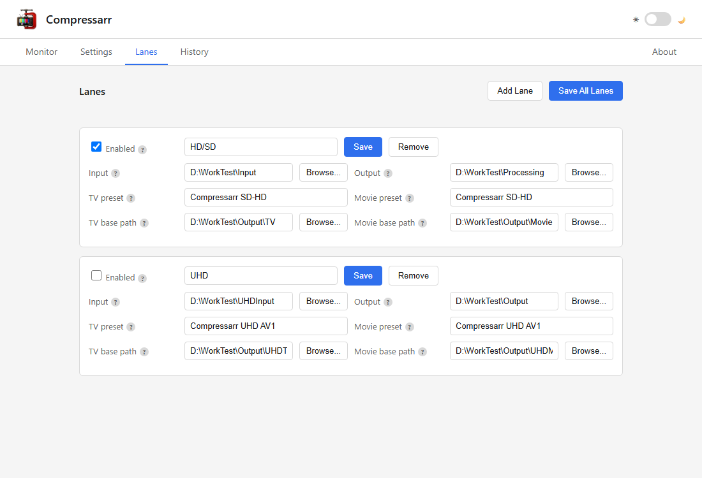

# Compressarr<br>

<sub><i>Because size matters.</i></sub>

**[compressarr.tv](https://compressarr.tv)** · **[Wiki (full setup guide)](https://github.com/MrWizardCT/Compressarr/wiki)**

<br clear="left">

> [!IMPORTANT]
> **This is the 2.2 beta (2.2.0-beta.1).** It adds an optional **day/night Scheduler**, **lane
> assignment** ("land this file in a different lane's library"), and keeps a file's place in the
> queue when FileBot renames it - see [What's new in 2.2](#whats-new-in-22-beta) below. It is a
> pre-release: the stable release is [v2.1.8](https://github.com/MrWizardCT/Compressarr/releases/tag/v2.1.8).
> Your settings and queue carry over in both directions (everything new is optional and additive).

A complete, end-to-end batch video conversion workflow - from the moment a file lands in a
watched folder to the moment you're notified it's done, with nothing manual in between.
Compressarr watches your folders, transcodes new video through
[HandBrakeCLI](https://handbrake.fr/downloads2.php), automatically files the result into an
organized TV Show/Movie library, cleans up after itself, optionally tells Sonarr/Radarr the
item no longer needs monitoring, and finishes with a standalone report plus a desktop
notification. v2 is a complete rewrite of the original PowerShell tool as a web-first app - a
system-tray-only background process with its entire UI (settings, lanes, monitoring, history,
reports) in your browser, reachable from any device on your LAN.
Both the original PowerShell version and v2 trace back to
[VidMonHB](https://github.com/mrpaulwasserman/VidMonHB), Paul Wasserman's original take on this
same idea.

Compressarr is designed to sit between apps like Radarr and Sonarr and your media server. Instead
of pointing an *arr app straight at your media library, point it at one of Compressarr's watched
folders - once it grabs a file and drops it there, Compressarr picks it up, compresses it, and
moves the finished result into your library's destination folder. That way only clean,
already-processed files ever reach your media server, keeping your library organized and at its
best quality while using a fraction of the space.

## What's new in 2.2 (beta)

- **Scheduler page** - an optional, off-by-default day/night schedule. Pick when "daytime" is (the
  same every day, one window for weekdays and another for weekends, or each day of the week) and
  Compressarr runs encodes at a lower priority then and a higher one outside it, changing a
  running encode's priority live at the boundary. Optionally **hold the queue** during the daytime
  entirely. See [Scheduler page](#scheduler-page).
- **Lane assignment** - a file dropped in the wrong lane's folder can be told to **land in a
  different lane's library**, without moving the file. See [Landing a file in a different
  lane](#landing-a-file-in-a-different-lane).
- **FileBot-renamed files keep their place in the queue** - a reorder, skip or preset override you
  set on a file is no longer lost when FileBot renames it.
- **Redirects are visible afterward** - the HTML report and the History page flag any run in which
  a file landed in a different lane than the one it was found in.
- **Encoder page and Profiles page** - two new pages under Monitor. **Encoder** is where the
  tools live (HandBrakeCLI, and the new optional ffmpeg). **Profiles** lists every encoding
  profile Compressarr has: its **own built-ins** (locked) plus **yours**. Compressarr now always
  uses its own profiles - HandBrake's `presets.json` is no longer read while encoding, and the
  *presets.json path / Install/Merge / Reload* controls are gone. You can **create, edit,
  duplicate and delete** HandBrake profiles in a built-in editor and **import** presets from an
  installed HandBrake or any presets file. Your profiles are backed up and exported with the rest
  of your settings. See [Encoder page](#encoder-page) and [Profiles page](#profiles-page).
- **ffmpeg as an optional second encoder (experimental)** - pick **ffmpeg** instead of HandBrake
  *per lane*. ffmpeg profiles are structured recipes (no raw command lines): encoder, quality,
  audio and subtitle track rules, auto-crop and auto-deinterlace. A profile editor shows
  **Preview decisions** for a real file - which tracks are kept or dropped and why, and the exact
  command. ffmpeg checks every finished file's **length against the source** before the original is
  touched (new **ERROR 111**), and files with **Dolby Vision or HDR10+** are handed to HandBrake
  (or refused) rather than silently losing that metadata. See [ffmpeg](#ffmpeg-experimental).
- **Migrates itself** - on the first start of 2.2, the presets your lanes use are copied from your
  HandBrake `presets.json` into Compressarr's own profiles; nothing changes behind your back.
- Under the hood: the queue's ordering/tracking rules live in one place, the conversion engine
  is split into small, separately-tested pieces, and the encoder is behind an engine-neutral
  interface - all pinned by a much larger automated test suite.


```
Watch folder → Detect TV/Movie → Convert (HandBrake) → File into library
   → Clean up source → Unmonitor in Sonarr/Radarr → Report + toast
```

1. **Watch** - each lane's Input folder is scanned for new video files, either once on demand
   (Run Once / Run Now) or continuously while monitoring is on.
2. **Detect** - every file is auto-classified as a TV episode or a Movie from its filename, no
   separate lanes needed for each.
3. **Convert** - HandBrakeCLI transcodes it using that content type's configured preset, with
   live progress (percent, fps, ETA) streamed into the Monitor page as it runs.
4. **File it** - the converted file, plus any companion files (subtitles, `.nfo`, artwork), is
   routed into an organized `Show Name\Season NN\` or `Movie Title\` folder.
5. **Clean up** - the original is deleted/recycled/kept per your setting, and now-empty source
   folders (including a TV show's own folder once its last file is converted) are removed from
   the source folder, leaving you with a clean workspace.
6. **Notify Sonarr/Radarr** *(optional)* - the matching episode/movie is marked as unmonitored so
   it isn't re-grabbed.
7. **Report** - a standalone HTML report is generated, and a Windows toast notification confirms
   the run is complete - click it to open the report, whether or not Compressarr is still
   running.

> [!NOTE]
> Compressarr contains no AI or machine learning at runtime. Movie/TV detection, file matching,
> and renaming all run on plain, inspectable regex pattern matching - the same deterministic
> logic every time, nothing generative involved.

## What it does

Compressarr watches an **open-ended set of content lanes** you define yourself - add, remove,
rename, and enable/disable them from the Lanes page, each with its own Input/Output folders and
TV/Movie presets.

Within each lane, TV Shows vs Movies is **auto-detected per file**: a filename carrying a
season/episode marker (`S01E01`, `1x01`, etc.) is treated as a TV episode, everything else as a
Movie. That detected type picks which preset applies (a lane's TV preset or Movie preset) and,
if "Move converted files" is enabled, which destination it's filed into afterward - TV episodes
go to `Show Name\Season NN\` under the lane's TV base path; Movies get their own per-title
subfolder under the Movie base path.

Whatever else belongs to a converted file - subtitles, `.nfo` files, artwork sharing its name -
moves along with it immediately, even if other not-yet-processed videos still share that same
source folder. Once every video in a folder has been converted (or otherwise cleared), the
now-empty folder itself is removed too.

Processing is **sequential** - one file at a time, no parallel encodes. If a run is
interrupted, relaunching resumes from the unprocessed files.

### FileBot pre-processing (optional)

If you don't run Sonarr/Radarr, filenames dropped into a watch folder often aren't clean enough
for reliable TV/Movie detection on their own. Settings > File Name Processing can optionally shell
out to the free [FileBot](https://www.filebot.net/) tool to rename and organize files - looked up
against TheTVDB/TheMovieDB - right before Compressarr scans a lane's Input folder. TV and Movies
each get their own enable toggle and Arguments, so one content type's naming rules never affect
the other; a TV episode-numbering picker (`S01E01` vs `1x01`) fills in FileBot's format string for
you. A file FileBot couldn't confidently rename shows an amber "Unmatched" badge in the Monitor
queue instead of failing silently. A file that FileBot *does* rename keeps its place in the queue,
along with any skip or preset override you had set on it - the rename is read from FileBot's own
output and the queue entry follows the file to its new name.

### Monitoring

The Monitor page is the control surface for continuous operation: **Start Monitoring** begins
watching every enabled lane on a configurable interval, with a live countdown to the next pass.
**Run Now** skips the rest of that countdown and starts immediately. **Abort** kills whatever
HandBrakeCLI process is currently running and stops monitoring outright - as opposed to **Stop
Monitoring**, which lets the file currently converting finish normally and then stops before
starting the next one (both the page and the tray icon reflect a stop the moment it's requested,
from either surface). The **In Queue** section lists every file still waiting across all enabled
lanes - lane, size, and preset - so you can see what's coming up without waiting for the current
file to finish. A file's place in the queue is locked in the moment Compressarr first sees it -
new arrivals always join at the end, and only you can move one afterward (nothing else, including
presets, skips, or later arrivals, ever reshuffles it). Drag a queued file to reorder it within
its lane, or use its menu to skip it, remove it from the queue, or override its preset for just
that one file, or choose which lane's library it **lands in** (see [Landing a file in a different
lane](#landing-a-file-in-a-different-lane)). If the [Scheduler](#scheduler-page) is holding the
queue for the daytime, the State shows **Held** and a **Run anyway** button starts encoding
immediately. The recent-log panel and CPU usage update live while a pass runs.



*The media shown is representational test data only, not the actual film - your own results
(speed, file size, savings) will vary based on your source files, hardware, and preset.*

### Reports and notifications

At the end of a run, Compressarr writes a **standalone HTML report** covering per-lane results
(each file's type, preset, and Sonarr/Radarr outcome), disk savings, any errors, and rolling
Today/This Month/This Year history. The Open report after run setting
(Always/On Error/Never) controls whether it opens automatically - independent of that setting, a
Windows toast notification also confirms completion and opens the report when clicked. Each
report is labeled with a running run number (`Run #237: ...`) - a persistent, cumulative count
of runs that actually processed at least one file. The History page also lists every report
still within your configured retention window, with columns for files, before/after size, and
percent saved. Every report also has a close button in the upper-right corner - most useful when
running as an installed app (PWA), which has no browser chrome of its own to close a tab with.

Beyond the toast, the Notifications page can send a message to Discord, Slack, Telegram, Pushover,
ntfy, Gotify, Notifiarr, IFTTT, or a custom webhook (which also covers Zapier, Make, n8n, Node-RED,
and Home Assistant) - add as many channels as you want, each with its own Trigger (always / only
on error or warning / never) and a Test button. On top of that per-run trigger, every channel
(and the toast) can also send an independent **daily and/or weekly digest** - a periodic summary
("Compressed N files, reducing original size from X GB to Y GB, saving Z% of original size")
instead of, or alongside, a message after every single run - with its own Test/Save/Clear controls
right on the row so you can verify it without waiting for the schedule.



*The media shown is representational test data only, not the actual film - your own results
(speed, file size, savings) will vary based on your source files, hardware, and preset.*



---

## Installation

1. Pick which installer you want from the [Releases](https://github.com/MrWizardCT/Compressarr/releases)
   page - both install and behave identically, the only difference is whether the .NET runtime
   comes bundled:
   - **`Compressarr-Setup-x.x.x.exe`** (smaller download) - requires the **.NET 10 ASP.NET Core
     Runtime (x64)** to already be installed. Direct download:
     [aspnetcore-runtime-10.0.11-win-x64.exe](https://builds.dotnet.microsoft.com/dotnet/aspnetcore/Runtime/10.0.11/aspnetcore-runtime-10.0.11-win-x64.exe)
     (this single installer includes the base .NET Runtime it depends on too - nothing else is
     needed, and you likely already have it if you run other ASP.NET Core-based apps or services).

     > If a newer .NET 10.0.x patch has since been released, the direct link above still works
     > fine (Compressarr just needs 10.0.x, any patch), but for the latest you can instead go to
     > the [general runtime page](https://dotnet.microsoft.com/en-us/download/dotnet/10.0/runtime) -
     > that page lists three similarly-named downloads, though, so pick carefully: **.NET Desktop
     > Runtime**, **ASP.NET Core Runtime**, and **.NET Runtime**. Compressarr needs the **ASP.NET
     > Core Runtime** specifically, since it hosts its own web UI. The Desktop Runtime looks like
     > the obvious pick for a desktop app, but it doesn't include what Compressarr actually needs -
     > Compressarr will refuse to start with a "You must install or update .NET" message if
     > that's the one you grab instead.
   - **`Compressarr-Setup-x.x.x-Full.exe`** (larger download) - includes its own copy of the .NET
     runtime, so there's nothing to install first. Use this one if you'd rather not deal with the
     runtime step above.
2. Run it and follow the installer. It installs to Program Files, adds a Start Menu shortcut
   (and an optional desktop icon), and registers a normal Windows uninstaller.

   > **A note on Windows SmartScreen**: Compressarr is signed with a real publisher certificate,
   > but Windows' reputation system also weighs how many machines
   > have already run the exact file you downloaded - so a freshly published release can still
   > occasionally show a SmartScreen prompt the first few days after release, before its
   > reputation has had time to build. This is expected, not a sign anything is wrong - the same
   > situation every independently-published Windows tool goes through, including ones you may
   > already trust and run daily (Sonarr, Radarr, and the rest of the *arr ecosystem included). If
   > SmartScreen shows "Windows protected your PC," click **More info**, then **Run anyway**.
   > Every release is also scanned with [VirusTotal](https://www.virustotal.com/) as part of
   > publishing it - the scan link is at the bottom of that release's notes on the
   > [Releases](https://github.com/MrWizardCT/Compressarr/releases) page, if you'd like to check
   > it independently.
4. Launch Compressarr from the Start Menu - it runs as a tray icon only, with no window of its
   own. Right-click the tray icon for **Open Web UI**, or just browse to
   `http://localhost:1212` (or whatever port you've configured).
5. On the **Encoder** page, use **Check/Install** next to HandBrakeCLI path to detect an existing
   install or download one automatically. Compressarr's own profiles (**Compressarr SD-HD** and
   **Compressarr UHD AV1**) are built in - there is nothing to install or merge. The Monitor page
   shows a *Finish setting up* notice until the tools your lanes need are found.
O

# ---------------------------------------------------------------- Settings table
rep(<<'O', "", 'settings rows');
| HandBrakeCLI path | Path to `HandBrakeCLI.exe` - Check/Install finds or downloads it |
| presets.json path | Path to HandBrake's presets.json - Install/Merge Presets adds Compressarr's own, Reload picks up changes made to the file without restarting Compressarr |
| Extra CLI options | Additional flags passed straight through to every HandBrakeCLI conversion |
O

# ---------------------------------------------------------------- Backups
rep(<<'O', <<'N', 'backup bullet');
- **HandBrake presets are not included** in the backup (it's HandBrake's own file, stored outside
  Compressarr's data folder). If HandBrake is also freshly installed, use the **Install/Merge
  Presets** button on Settings (in the HandBrake card) to re-add Compressarr's presets to it.
O
- **Your own encoding profiles are included** (HandBrake and ffmpeg), so a restore brings back the
  profiles your lanes use. HandBrake's own `presets.json` is not - Compressarr no longer uses it;
  the generated file HandBrake is handed is rebuilt automatically. The HandBrake and ffmpeg
  *programs* themselves are not in the backup - on a fresh machine use **Check/Install** on the
  Encoder page.

---

## Configuring Compressarr

Everything is configured from the browser - there's no desktop settings window. Every field on
these pages has a small **?** next to it with a tooltip explaining what it does.

### Settings page



| Field | What it's for |
|---|---|
| HandBrakeCLI path | Path to `HandBrakeCLI.exe` - Check/Install finds or downloads it |
| presets.json path | Path to HandBrake's presets.json - Install/Merge Presets adds Compressarr's own, Reload picks up changes made to the file without restarting Compressarr |
| Extra CLI options | Additional flags passed straight through to every HandBrakeCLI conversion |
| FileBot Enabled | Turns on the optional FileBot pre-processing pass described above |
| FileBot path | Path to `filebot.exe` |
| Process movies / Movie Arguments | Per-type enable toggle and FileBot CLI arguments for Movies |
| Process TV shows / TV episode numbering / TV Arguments | Per-type enable toggle, `S01E01`-vs-`1x01` numbering picker, and FileBot CLI arguments for TV |
| Video extensions | Comma-separated file extensions to scan for (default: `mkv, avi, mp4, mpg, ts, m4v`) |
| Minimum size | Skip files smaller than this - useful for ignoring samples/junk (choose KB/MB/GB) |
| Max files per run | Caps how many files are picked up in one pass (0 = no limit) |
| Write output to same folder as input | Convert in place instead of using each lane's Output folder |
| Move converted files into show/movie folders | Turns on the TV/Movie filing step described above |
| Clear title metadata | Strips the embedded title tag (via TagLib-Sharp) so a media server reads the filename instead of stale/incorrect metadata - on by default |
| Original file after convert | Maintain, Delete, or Recycle the source file once conversion succeeds |
| Companion file extensions | Which sibling file extensions (subtitles, `.nfo`, artwork, etc.) move along with a converted file |
| Unmatched companion file handling | Maintain, Delete, or Recycle a companion file whose extension isn't on that list |
| On destination collision | Overwrite (default), Skip, or Rename, when a file already exists at the destination |
| Log folder / Report folder | Where run logs, the history CSV, and HTML reports are written |
| Log/report retention (days) | Logs and reports older than this are cleaned up automatically (0 = keep forever) |
| Open report after run | Always, On Error, or Never |
| Enable Monitoring at Startup | Start watching lanes automatically when Compressarr launches |
| Poll interval (seconds) | How often the monitor loop checks lanes while monitoring is on |
| Queue Completion display | Show the Monitor page's estimated finish time as an absolute date/time, or a countdown duration like `2d 5h 36m` |
| Start with Windows (on login) | Registers Compressarr to launch automatically at login |
| Post-execution command/arguments | Optional command to run after each pass completes |
| Sonarr/Radarr Enabled, URL, API Key | See below |
| Port | Port the web UI listens on - changing this needs a restart |

**Sonarr/Radarr integration**: after a file finishes converting successfully, Compressarr can
tell whichever app tracks it to stop monitoring that specific episode or movie, so it isn't
re-grabbed later. Matching is done entirely through the app's own `/api/v3/parse` endpoint -
Compressarr hands it the original filename, and the app's own parser reports back which
series/episode or movie it matches, if any. A miss is always treated as "leave it alone," never
as a guess.

**Install as app** (Web UI section): the whole app is an installable PWA - useful on a phone or
tablet, or for one-tap desktop access without a browser tab. This card shows whichever of three
states actually applies: a real **Install as app** button (Chrome/Edge/Android), static "tap
Share, then Add to Home Screen" instructions (iOS Safari has no installable prompt at all), or -
if you're already running the installed app - instructions for uninstalling it from the browser's
own app list, since no web page can trigger that directly.

### Backups

Settings also has a Backups card that periodically zips up your full setup - settings, lanes,
resume state, run counter, and history - to a local or network folder you choose, with
configurable interval and retention, plus a **Backup Now** button for an on-demand backup and a
list of existing backups you can restore from with one click.

#### Restoring from a backup

If your machine crashes or you're moving to a new build, Compressarr can restore your full setup
from a backup `.zip` created by the Backups feature above.

1. Install and launch Compressarr on the new machine. This creates a fresh default configuration -
   no lanes, everything empty.
2. Get the backup `.zip` onto the new machine. Restore lists the contents of a *folder*, not a
   single file elsewhere, so place it somewhere Compressarr can see it: the default
   `%CompressarrAppData%\Backups` location, any local/external drive folder, or a UNC network
   share.
3. Open the web UI and go to **Settings > Backups**.
4. In the **Folder** field, point it at wherever you put the file - type the path (a UNC path like
   `\\server\backupfolder` works too) and click elsewhere, or use **Browse...** to navigate to it.
   This works even before you've saved any settings on the new machine.
5. The **Existing backups** table below refreshes automatically and should list your backup file
   (name, size, date).
6. Click **Restore** on that row and confirm the warning dialog.

Your settings, lanes, your own profiles, resume state, run counter, and history are restored from
the backup.

Two things to know:
- **HandBrake presets are not included** in the backup (it's HandBrake's own file, stored outside
  Compressarr's data folder). If HandBrake is also freshly installed, use the **Install/Merge
  Presets** button on Settings (in the HandBrake card) to re-add Compressarr's presets to it.
- Use **Backup Now** on Settings at any time to take a fresh backup before decommissioning a
  machine, rather than relying only on the automatic schedule.

### Notifications page



Get a message wherever you already look - Discord, Slack, your phone, a self-hosted push server,
or any automation platform - when a run finishes. Every channel is optional and off by default;
add as many as you want, of as many different types as you want (two Discord servers, a Slack
workspace, and a phone push, all at once).

**Desktop toast notifications**: a Windows toast confirming completion and opening the report when
clicked. Off by default (useful on a desktop machine, not needed for a headless/server install) -
toggle it on the Notifications page.

**Notification channels**: click **Add Channel**, pick a service from the dropdown, and fill in
its fields - every field has a **?** bubble next to it explaining what it needs and, where
relevant, where to find it. Each channel has:

| Field | What it's for |
|---|---|
| Trigger | Always, On error or warning, or Never (kept configured but disabled without deleting it) |
| Name | A friendly label to tell channels of the same type apart, e.g. two different Discord servers |
| Test | Sends a test message using whatever's currently typed in, even if not yet saved |
| Save / Remove | Persist or delete this channel |

**Daily/weekly digests**: independent of Trigger above, every channel - and the desktop toast -
can also send a periodic summary instead of, or alongside, a message after every single run.
Right on each channel's own row:

| Field | What it's for |
|---|---|
| Daily / Weekly | Independent on/off toggles - enable one, both, or neither |
| at (time) | What time each one fires, local time - Daily and Weekly each have their own |
| on (day) | Which day of the week Weekly fires |
| Test | Sends a real digest right now, using today's actual numbers, once per digest type currently checked - bypasses the schedule entirely |
| Save | Same as the channel's own Save button |
| Clear | Unchecks both Daily and Weekly without saving |

A digest reads: *"Compressed 12 files, reducing original size from 45.3 GB to 21.1 GB, saving
53.4% of original size."* Want digest-only for a channel? Set its Trigger to **Never** and enable
Daily and/or Weekly - the two are independent, so any combination works.

**Message Format**: controls the Title/message text sent to Discord, Slack, Telegram, Pushover,
ntfy, Gotify, and Notifiarr when a run completes (it doesn't affect the desktop toast above, or
the Generic Webhook's raw JSON payload, though the Title/Body text it produces does also flow into
IFTTT's `value1`/`value2` and the Generic Webhook's own `title`/`message` fields alongside their
other structured data). Pick a **Style**:

| Style | Example |
|---|---|
| Minimal | `12 file(s), 24.1 GB saved.` |
| Standard | `12 file(s) processed, 24.1 GB saved (53.4%) in 42 min.` |
| Detailed | `12 file(s) processed in 42 min.`<br>`45.3 GB -> 21.1 GB (53.4% smaller)`<br>`Errors: 0 - Warnings: 0` |
| Custom | Write your own Title and Body templates using the same tokens below |

Every style shares one Title line: `Compressarr run #{run_number} - {outcome}`. A live **Preview**
on the page shows exactly what the current style/template will produce, using real numbers from
your history. Custom templates use `{token}` placeholders - an unrecognized token is left as
literal text rather than breaking the message:

| Token | Value |
|---|---|
| `{run_number}` | The sequential run number |
| `{files}` | Files processed this run |
| `{saved_gb}` / `{saved_pct}` | Space saved, in GB / as a percent |
| `{before_gb}` / `{after_gb}` | Total size before/after, in GB |
| `{duration}` | How long the run took |
| `{outcome}` | Success / Warning / Error |
| `{error_count}` / `{warning_count}` | Counts for this run |
| `{retries_succeeded}` | Files recovered via automatic retry this run |
| `{report_path}` | Local path to this run's HTML report |
| `{today_files}` / `{today_saved_gb}` | Rollup for today so far |
| `{month_files}` / `{month_saved_gb}` | Rollup for this calendar month so far |
| `{year_files}` / `{year_saved_gb}` | Rollup for this calendar year so far |
| `{file_list}` | This run's filenames, one per line - see below |

`{file_list}` is deliberately left out of Minimal/Standard/Detailed and every other token's data -
it's the one token that can put a media filename in front of wherever a Custom template sends it,
so it only ever appears in a message if you type it into a Custom template yourself.

**What data is sent**: every channel receives the run number, an aggregate summary (e.g. "12
file(s) processed, 4.2 GB saved"), and the outcome (success/warning/error) - never filenames,
media titles, folder paths, or anything else from your configuration. The one exception is the
local path to the HTML report file, which only the **Generic Webhook** and **IFTTT** channels
include - worth knowing before pointing either at a third-party service, since a path like
`C:\Users\you\AppData\Roaming\Compressarr\Reports\...` leaves your machine as plain text. Every
other channel type (Discord, Slack, Telegram, Pushover, ntfy, Gotify, Notifiarr) never sends the
report path at all. A digest isn't tied to any single run, so it never includes a report path
either way, regardless of channel type.

The other exception is filenames themselves, but only if you opt in: a Custom template that uses
`{file_list}` sends whatever filenames it renders to that channel's destination. No built-in style
does this, and a digest can't use Custom templates at all, so this only ever happens if you've
deliberately added `{file_list}` to a channel's own Custom Title/Body.

#### Supported services

| Service | What it needs |
|---|---|
| [Generic Webhook](#generic-webhook-zapier-make-n8n-node-red-home-assistant) | A URL, HTTP method, and optional custom headers |
| [Discord](#discord) | A channel webhook URL |
| [Slack](#slack) | An incoming webhook URL |
| [Telegram](#telegram) | A bot token and chat ID |
| [Pushover](#pushover) | An application token and user key |
| [ntfy](#ntfy) | A server URL (defaults to the public ntfy.sh) and topic |
| [Gotify](#gotify) | Your self-hosted server URL and an application token |
| [Notifiarr](#notifiarr) | Your Notifiarr API key and a Discord channel ID |
| [IFTTT](#ifttt) | An event name and your Webhooks key |

##### Generic Webhook (Zapier, Make, n8n, Node-RED, Home Assistant)

Posts a JSON body (title, outcome, file count, space saved, duration, report path) to any URL you
give it, with an HTTP method and custom headers of your choosing. This single channel type also
fully covers **Zapier** ("Webhooks by Zapier"), **Make** ("Webhooks" module), **n8n** (Webhook
node), **Node-RED** (`http in` node), and **Home Assistant** (a webhook automation trigger) - all
of them accept an arbitrary POST with no required shape, so just point this at whichever
platform's own webhook URL.

##### Discord

In Discord, go to a channel's **Edit Channel > Integrations > Webhooks**, create one, and paste
its URL into the Webhook URL field. Compressarr posts a color-coded embed (green/yellow/red for
success/warning/error) with file count, space saved, and duration.

##### Slack

Create an **Incoming Webhook** for your workspace at [api.slack.com/apps](https://api.slack.com/apps)
and paste its URL in. Messages use Slack's mrkdwn formatting with a status emoji.

##### Telegram

Message **@BotFather** on Telegram to create a bot and get its Bot Token. For the Chat ID, message
**@userinfobot** to find your own, or check your bot's `getUpdates` response for a group/channel
ID. Messages are sent as plain text.

##### Pushover

Create an Application at [pushover.net/apps/build](https://pushover.net/apps/build) for the
Application API Token, and find your User Key on your Pushover dashboard.

##### ntfy

Works with the public [ntfy.sh](https://ntfy.sh) instance out of the box - just pick a Topic (any
string; make it unique and hard to guess, since anyone who knows it can subscribe to it too). If
you self-host ntfy, change the Server URL to point at your own instance. An optional Access Token
supports protected topics.

##### Gotify

Gotify is self-hosted only (no public hosted service) - point Server URL at your own instance, and
create an Application in Gotify's web UI (Apps tab) for the Application Token.

##### Notifiarr

Built for the *arr ecosystem: relays into whichever Discord channel your Notifiarr integration is
configured to post to. Find your API Key on your Notifiarr account page under **My Account > API
Key**. For the Discord Channel ID, enable Developer Mode in Discord (User Settings > Advanced),
then right-click the target channel and **Copy Channel ID**.

##### IFTTT

Create an applet with a **Receive a web request** trigger and give it an Event Name (used in the
Event Name field here). Find your Webhooks Key at
[ifttt.com/maker_webhooks](https://ifttt.com/maker_webhooks) under Documentation - it's the string
after `/use/` in your personal URL. Compressarr sends title/body/report path as IFTTT's
`value1`/`value2`/`value3` ingredients for use in your applet's action.

### Scheduler page

The Scheduler (sidebar, after Lanes) is an **optional** day/night schedule - **off by default**, so
until you switch it on Compressarr behaves exactly as it always has. A "Right now" card at the top
shows the current mode, when it next changes, and whether the queue is held; the rest of the page is
the schedule itself, with a description of every setting at the bottom. All times use this PC's
local clock, so daylight saving is followed automatically.

| Setting | What it does |
|---|---|
| Enable the day/night schedule | Master switch. Off = no effect at all. |
| Only encode during off-hours | Hold the queue during the daytime window: no *new* file starts until off-hours begin. New files are still found and queued in arrival order while they wait. |
| If the daytime starts mid-encode | With the hold on: **finish the current file, then hold** (never interrupts an encode), or **suspend it until off-hours** (freezes it, resumes when off-hours return). |
| Daytime window | **Same every day**, **Weekdays and weekends**, or **Each day of the week**. A window may cross midnight (22:00-06:00). **Run Off-hours Priority All Day** on a window gives that day no daytime window. |
| Daytime / Off-hours priority | Low, Below Normal, Normal, Above Normal, High or Realtime. An encode already running when the window changes switches priority at once. By default: Below Normal by day, Normal at night - Normal is what encodes always used before this feature. |

A few things worth knowing:

- **Priority doesn't change how much CPU an encode wants** - HandBrake uses nearly every core
  regardless. Priority decides who wins when other programs want CPU time too. High and Realtime
  can make the PC sluggish or unresponsive while an encode runs, and Realtime needs administrator
  rights (without them Windows treats it as High).
- **Run anyway** (on the Scheduler page and the Monitor) releases a hold for the rest of the current
  daytime window; it is never saved. Stop Monitoring, or pressing Resume on a suspended encode, also
  releases it so neither waits on a frozen encode.
- The Monitor's **queue completion estimate counts the time the queue spends held**, and the toolbar
  shows a tag ("Daytime - low priority", "Off-hours - full speed", "Paused until 10:00 PM").

### Encoder page

Where Compressarr's encoding tools are set up. (Until 2.2 the HandBrake fields lived on Settings.)

- **At a glance** - whether HandBrake and ffmpeg are found, their versions, how many profiles each
  has, and which lanes use each.
- **HandBrake** - the `HandBrakeCLI.exe` path (**Check/Install** finds an existing copy or
  downloads one into Compressarr's own folder) and **Extra CLI options** added to every HandBrake
  encode. There is no presets.json path any more: HandBrake is handed Compressarr's own profiles.
- **ffmpeg (experimental)** - see [ffmpeg](#ffmpeg-experimental) below.

### Profiles page

Every encoding profile Compressarr has, for both encoders: the **built-ins** that ship inside the
app (locked - a lock icon, and they can't be edited or deleted) and **your own**. Each row shows the
encoder, container, video and audio summary, and which lanes use it.

- **View / Edit** opens the profile's editor; **Duplicate** copies any profile (a built-in becomes
  your own); **Delete** removes one of yours (refused while a lane or a queued file still uses it);
  renaming a profile updates every lane and queued file that uses it.
- **New HandBrake profile / New ffmpeg profile** start from a copy of any existing profile.
- **Import...** (HandBrake profiles) copies presets into Compressarr from **an installed HandBrake**
  (it reads its `presets.json` - only read, never written) or **any HandBrake presets file** (the
  `.json` from HandBrake's *Presets -> Export*, a shared preset, ...). You pick which ones; a name
  that's already used can be kept alongside (" (imported)"), replace yours, or be skipped.
  Built-ins are never replaced.
- **Duplicate as ffmpeg...** turns a HandBrake profile into the closest ffmpeg profile and lists
  what ffmpeg couldn't carry over (denoise/sharpen filters, resizing, burn-in, ...).

The **HandBrake editor** shows the settings that matter - container, encoder, quality (RF or
bitrate), speed, profile/level/tune, frame rate, deinterlace, crop, audio language/track rules and
pass-through list, bitrate and mixdown, subtitles and chapters - with the exact command shown
beside it. Everything the editor doesn't show (extra picture filters, per-track audio settings, ...)
is **kept exactly as stored**; a save with no changes leaves the profile byte-for-byte as it was.

Where they live: built-ins inside the app; yours in `%AppData%\Compressarr\Profiles\`
(`handbrake-profiles.json`, `ffmpeg-profiles.json`) - included in backups and in Export config.
For every HandBrake encode Compressarr hands HandBrake one generated file
(`Profiles\handbrake-active.json`: built-ins plus yours), rewritten only when it is missing or
different. HandBrake's own presets file is never touched.

### ffmpeg (experimental)

ffmpeg is an **optional second encoder**: nothing changes until you pick **ffmpeg** as a lane's
**Encoder** on the Lanes page. It is labelled experimental because it will not produce
byte-identical output to HandBrake (similar codec settings give similar, not identical, size and
quality), and it has had far less real-world use.

- **Setup** - on the Encoder page, **Check/Install** first looks for an ffmpeg already on this
  computer; if there isn't one it offers a managed download (BtbN's GPL build from GitHub, a few
  hundred MB) after telling you the name, size and source. The download is verified against the
  SHA-256 GitHub publishes for it and unpacked into Compressarr's own folder - only `ffmpeg.exe`,
  `ffprobe.exe` and the license are kept. The card also shows what your build can do (x265,
  SVT-AV1, NVENC, ...), and the Profiles page flags any profile your build can't run.
- **Profiles** - three built-ins mirror the HandBrake ones (**Compressarr SD-HD**, **Compressarr
  UHD AV1**) plus **HEVC NVENC (fast)** for NVIDIA GPUs. A profile is structured data: encoder and
  speed, quality (CRF or bitrate), pixel format, deinterlace (*auto* only when the file is flagged
  interlaced), crop (*auto* samples the file for black bars), audio language order and
  first/all tracks, *pass through when the format is ticked, otherwise encode*, subtitle rules,
  chapters. Track selection works like HandBrake's: walk the language list in order; `und` matches
  an untagged track and `any` matches everything; if nothing matches, the first audio track is
  kept rather than none. MP4 can only hold text subtitles - picture subtitles (PGS, DVD) are
  dropped and the preview says so.
- **Preview decisions** (in the editor) reads a real file with ffprobe and shows, per track, what
  would be copied, encoded or dropped and why - plus deinterlace, crop, HDR, and the exact command.
- **Safety net** - after ffmpeg exits, the finished file is read back and its **length must match
  the source**. A truncated result (a corrupt source, a full disk) is reported as **ERROR 111** and
  the original is left alone.
- **Dolby Vision / HDR10+** - stock ffmpeg would silently drop that dynamic metadata, so such a
  file goes to **HandBrake** using the ffmpeg profile's *HandBrake profile for Dolby Vision /
  HDR10+ files* (the built-ins point at their HandBrake namesakes). With no fallback profile, or
  HandBrake missing, the file is **refused** (ERROR 112) and left untouched. Ordinary HDR10 is
  handled by ffmpeg itself (colour information and mastering-display data are carried over).
- **Report and Monitor** show which encoder encoded each file ("ffmpeg", or "HandBrake (Dolby
  Vision fallback)"); a lane whose encoder isn't installed is skipped with **ERROR 113** without
  stopping your other lanes.
- Scheduler priority, pause/resume and abort work for ffmpeg exactly as for HandBrake.

### Lanes page



Add, remove, rename, and enable/disable lanes freely - there's no fixed limit. Each lane has:

| Field | What it's for |
|---|---|
| Enabled | Turns this lane's processing on/off without clearing its configured paths |
| Input | Where Compressarr looks for source video files for this lane |
| Output | Where HandBrake writes the converted file initially |
| Encoder | Which tool encodes this lane's files: **HandBrake** (default) or **ffmpeg** (experimental) - see [ffmpeg](#ffmpeg-experimental) |
| TV profile / Movie profile | Encoding profile used for each detected content type, picked from that encoder's own profiles on the [Profiles page](#profiles-page) |
| TV base path / Movie base path | Final destination once a file's type has been detected, if Move converted files is on |

Every path field has a **Browse...** button that opens a server-side folder picker, since a
browser's native file picker can't see the server's filesystem. **Save All Lanes** saves every
lane on the page in one click.

### How files move through a lane

**Output** is a transient staging spot, not a final destination - it's just where HandBrake
writes the converted file the moment encoding finishes. If **Move converted files into
show/movie folders** is on, the file (and any companion subtitles/`.nfo`/artwork) is picked up
from there and relocated into the lane's TV/Movie base path; if that setting is off, everything
just stays wherever Output put it.

```
D:\Media\Input\                              (before a run)
├── Breaking Bad S01E01.mkv
├── Breaking Bad S01E01.eng.srt
├── Breaking Bad S01E02.mkv
├── Breaking Bad S01E02.eng.srt
├── Caddyshack (1980).mkv
└── Caddyshack (1980).nfo

        │  HandBrake converts each file with the lane's TV/Movie
        │  preset, writing the result to Output - then, since Move
        │  converted files is on, each one is relocated below.
        ▼

D:\Media\TV\                                 (this lane's TV base path)
└── Breaking Bad\
    └── Season 01\
        ├── Breaking Bad S01E01.mkv
        ├── Breaking Bad S01E01.eng.srt
        ├── Breaking Bad S01E02.mkv
        └── Breaking Bad S01E02.eng.srt

D:\Media\Movies\                             (this lane's Movie base path)
└── Caddyshack (1980)\
    ├── Caddyshack (1980).mkv
    └── Caddyshack (1980).nfo

D:\Media\Input\                              (after - now empty, ready
                                               for the next batch)
```

Originals are deleted, recycled, or kept per **Original file after convert**; if a source
subfolder ends up with nothing left to convert, it's removed too - including a TV show's own
folder once its last episode has been converted.

### Landing a file in a different lane

Say Sesame Street was dropped in your SD-HD lane's folder but belongs in your Kids library. On the
Monitor page, use the **Lands in** dropdown on that file's row and choose Kids. When the file
finishes it is filed into **Kids' TV or Movie library** instead - and nothing else changes: the file
is **never moved** (so Sonarr/Radarr never see it go missing and can't re-grab it), it still uses
its own lane's preset (use the per-file preset override to change that), it is staged in its own
lane's Output folder, keeps its place in the queue, and its source folder is cleaned up against its
own lane's Input folder. A "↪ Kids" marker beside the lane name shows it is redirected; choosing the
file's own lane again clears it.

- **If the destination can't be reached** (offline share, full disk) the finished file waits safely
  in Output and is retried every pass, like any failed move - it is **never** filed in the library you
  were avoiding.
- **If you delete the destination lane**, the Lanes page tells you how many queued files point at it.
  Those files wait in Output (the row shows "Deleted lane - held in Output") until you pick a new
  destination. A disabled destination lane works fine.
- **Reports show it**: the HTML report tags each redirected file ("Landed in Kids - redirected from
  SD-HD") and lists them in a banner, and the History page highlights a run containing redirects in
  a distinct violet colour - deliberately not red or yellow, since a redirect is your choice, not a
  problem.

### Built-in profiles

Compressarr ships with two of its own HandBrake profiles, built into the app (see the
[Profiles page](#profiles-page)) - they're what the sample lanes above use for TV profile / Movie
profile. ffmpeg has counterparts of the same names, plus an NVENC one.

**Compressarr SD-HD** - for standard and HD sources. Encodes to H.265 (x265, 10-bit, Main10
profile) at a constant quality slider of 24, using the "veryfast" encoder preset with two-pass
encoding (turbo first pass). Audio is mixed down to E-AC3 (Dolby Digital Plus) at 512 kbps,
supporting up to 7.1 channels. Also auto-crops black bars, keeps English subtitles, and
preserves chapter markers.

**Compressarr UHD AV1** - for 4K/UHD sources. Encodes to AV1 (SVT-AV1, 10-bit, Main profile) at
a constant quality slider of 30, encoder preset 4 (tuned for PSNR), with two-pass encoding
(turbo first pass). Audio tracks are copied through as-is where possible, falling back to E-AC3
at 640 kbps otherwise. Same auto-crop, English subtitles, and chapter markers as above.

In testing, both presets have achieved size reductions of **80% or more**, depending heavily on
the source file's original bitrate, resolution, and codec - an already efficiently-encoded
source will see smaller savings than a large, lightly-compressed one.

### Saving and running

- **Save Settings** / **Save** (per lane) write changes back to the config without running
  anything.
- **Run Once** (Settings page) runs a single pass immediately with whatever's currently saved.
- **Start Monitoring** / **Stop Monitoring** / **Run Now** / **Abort** (Monitor page) control
  continuous operation - see [Monitoring](#monitoring) above.

---

## Running it

Compressarr has no command-line interface - it's a tray-only background app. Right-click the
tray icon for:

- **Open Web UI** - opens the browser to Compressarr's own address
- **Start Monitoring** / **Stop Monitoring** - mirrors the Monitor page's buttons; either surface
  reflects the other's state
- **Exit** - shuts down the web server and closes Compressarr

If **Enable Monitoring at Startup** is on (Settings page), monitoring begins automatically as
soon as Compressarr launches - useful together with **Start with Windows** for a fully
hands-off setup.

## Configuration file reference

Config is JSON, stored per-user at `%AppData%\Compressarr\compressarr.settings.json` rather than
next to the install folder, so upgrades never overwrite your settings. Paths may contain
`%ENVVAR%` tokens (e.g. `%ProgramFiles%`, plus Compressarr's own `%CompressarrAppData%`),
expanded at the point of use. This shows the shipped defaults - lanes start empty; add your own
from the Lanes page.

```json
{
  "HandBrake": {
    "CliPath": "%ProgramFiles%\\HandBrake\\HandBrakeCLI.exe",
    "PresetsPath": "%appdata%\\HandBrake\\presets.json",
    "Options": ""
  },
  "FFmpeg": {
    "Path": "%CompressarrAppData%\\tools\\ffmpeg\\ffmpeg.exe",
    "ProbePath": "%CompressarrAppData%\\tools\\ffmpeg\\ffprobe.exe",
    "Options": ""
  },
  "FileBot": {
    "Enabled": false,
    "CliPath": "%ProgramFiles%\\FileBot\\filebot.exe",
    "TvEnabled": true,
    "TvArgs": "",
    "MovieEnabled": true,
    "MovieArgs": ""
  },
  "Lanes": [],
  "Processing": {
    "VidTypes": ["mkv", "avi", "mp4", "mpg", "ts", "m4v"],
    "OutSameAsIn": false,
    "DeleteAfterConvert": "Recycle",
    "MoveFiles": true,
    "ClearTitleMetadata": true,
    "Limit": 0,
    "MinSizeBytes": 0,
    "CompanionExtensions": ["srt", "nfo", "jpg", "jpeg", "png", "tbn", "ass", "ssa", "idx", "sub", "vtt"],
    "UnmatchedCompanionAction": "Recycle",
    "OnDestinationCollision": "Overwrite"
  },
  "Logging": { "LogFilePath": "%CompressarrAppData%\\Logs", "RetentionDays": 30 },
  "PostExec": { "Cmd": "", "Args": "" },
  "Report": { "ReportPath": "%CompressarrAppData%\\Reports", "OpenAfterRun": "OnError" },
  "Repeat": { "Count": 0, "Monitor": false, "PollIntervalSeconds": 60, "QueueEtaFormat": "Duration" },
  "Startup": { "CountdownSeconds": 10, "RunAtLogin": false },
  "Arrs": {
    "Sonarr": { "Enabled": false, "Url": "", "ApiKey": "" },
    "Radarr": { "Enabled": false, "Url": "", "ApiKey": "" }
  },
  "Schedule": {
    "Enabled": false,
    "Mode": "Everyday",
    "DayStart": "08:00",
    "DayEnd": "22:00",
    "WeekendDayStart": "10:00",
    "WeekendDayEnd": "20:00",
    "Days": [],
    "DayPriority": "BelowNormal",
    "NightPriority": "Normal",
    "OnlyEncodeOffHours": false,
    "WhenDayStarts": "FinishCurrentFile"
  },
  "Web": { "Port": 1212 },
  "Backup": {
    "FolderPath": "%CompressarrAppData%\\Backups",
    "IntervalDays": 7,
    "RetentionDays": 28
  },
  "Notifications": {
    "ToastEnabled": false,
    "ToastDigestDailyEnabled": false,
    "ToastDigestWeeklyEnabled": false,
    "ToastDigestDailyTime": "09:00",
    "ToastDigestWeeklyTime": "09:00",
    "ToastDigestWeeklyDay": "Monday",
    "Channels": []
  }
}
```

`Schedule` is written by the Scheduler page (`Mode` is `Everyday`, `WeekdaysAndWeekends` or `EachDay`;
`Days` holds seven `{Start, End}` windows, Sunday first, used in `EachDay` mode; a window whose start
equals its end means no daytime window; priorities are `Low`, `BelowNormal`, `Normal`, `AboveNormal`,
`High` or `Realtime`; `WhenDayStarts` is `FinishCurrentFile` or `SuspendEncode`). `QueueEtaFormat` is `"DateTime"` or `"Duration"` - see the Settings table above.
 Each entry in
`Notifications.Channels` also carries its own `DigestDailyEnabled`/`DigestWeeklyEnabled`/
`DigestDailyTime`/`DigestWeeklyTime`/`DigestWeeklyDay`, same shape as the toast fields above,
alongside its `Type`/`Trigger`/`Settings` - added from the Notifications page, not hand-edited here.

`HandBrake.PresetsPath` is no longer shown or used while encoding (Compressarr uses its own
profiles); it stays in the file for 2.1.x compatibility and is used only to find your old
`presets.json` for the one-time migration and as Import's default location. Each lane may carry
`"Engine": "HandBrake"` (the default) or `"FFmpeg"`; a 2.1.x install ignores the field. Your own
profiles are not in this file - they are in `%AppData%\Compressarr\Profiles\`.

The output file extension is derived from whichever profile was selected, rather than being
hardcoded.

## Project layout

```
src/
  Compressarr.Core/       Conversion engine, config, reporting, HandBrake/Sonarr/Radarr clients -
                           platform-agnostic, no UI dependencies
  Compressarr.Web/         Minimal-API endpoints + wwwroot (the entire browser UI: vanilla JS/HTML/CSS)
  Compressarr.Desktop/     Tray-only host - Avalonia TrayIcon, Windows toast notifications, composition root
installer/
  Compressarr.iss           Inno Setup script - builds both installer variants (regular and
                             bundled "Full") from one script via an ISPP /DFULL define
tests/
  Compressarr.Core.Tests/   xUnit tests for Core
CHANGELOG.md               Release history
```

## TagLib-Sharp (metadata handling)

Compressarr uses [TagLib-Sharp](https://github.com/mono/taglib-sharp) to strip the embedded title
tag from converted files, so a media server reads the filename instead of a stale/incorrect title
baked into the file's metadata. This is controlled by the **Clear title metadata** setting on the
Settings page (on by default).

- **What it is**: an open-source, cross-platform .NET library for reading and writing media file
  tags.

## Disclaimer

Compressarr is intended for personal use only, with media files you legally own or otherwise have
the right to compress and manage. You are solely responsible for ensuring your use complies with
applicable copyright law and any licensing terms attached to your media. This tool is provided
as-is, with no warranty of any kind - use it at your own risk.

## License

Compressarr is licensed under the [GNU General Public License v3.0](LICENSE).

Copyright (C) 2026 Mark Wasserman
